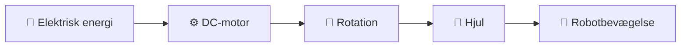
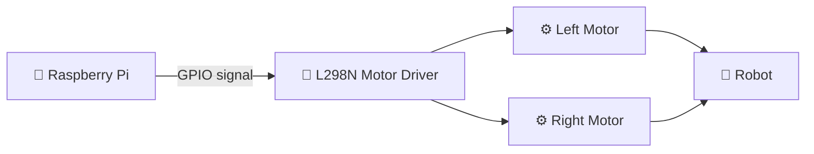
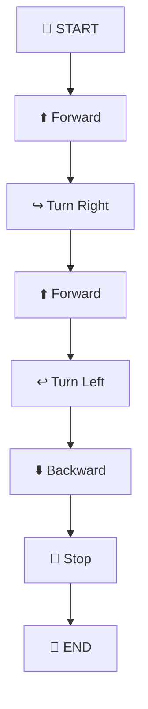
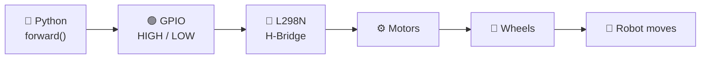
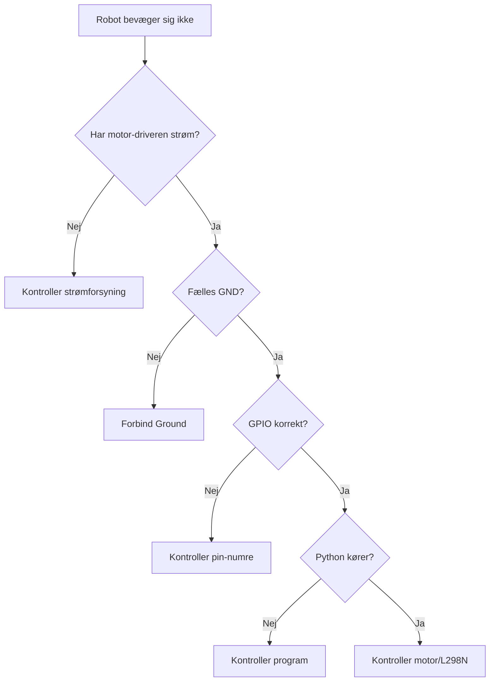
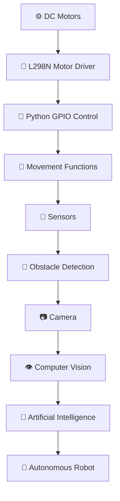

# 🤖 Motors & Movement — Revision

## DC-motorer • L298N • H-Bridge • GPIO • Python • Robotbevægelse


---

> ### 🎯 Tema
>
> I denne lektion lærer vi, hvordan en **Raspberry Pi** kan styre en mobil robots DC-motorer ved hjælp af en **L298N Motor Driver** og **Python**.

---

# 📚 Indhold

1. ⚙️ Introduktion til DC-motorer
2. 🔋 Hvordan virker en DC-motor?
3. 🧩 Motor Driver — L298N
4. ⚠️ Hvorfor har vi brug for en Motor Driver?
5. 🔄 Hvad er en H-Bridge?
6. 🔌 Ledningsdiagram
7. 🟢 GPIO-grundlag
8. 🐍 GPIO-motorstyring med Python
9. 🧪 Første motortest
10. 🚗 Bevægelsesfunktioner
11. ↩️ Venstre og højre drejning
12. 🧭 Robotbevægelse
13. 🧪 Laboratorieopgaver
14. 🎥 Live Demos
15. 🎯 Læringsmål
16. 🚀 Næste skridt mod autonom robot

---

# ⚙️ 1. Introduktion til DC-motorer

En **DC-motor — Direct Current Motor** omdanner elektrisk energi til mekanisk rotation.

DC-motorer bruges meget ofte i mobile robotter, fordi de er:

* relativt billige,
* nemme at styre,
* kompakte,
* hurtige,
* velegnede til robot-hjul.

En simpel robot kan eksempelvis have to DC-motorer:

```text
                    FRONT
                      ↑
             ┌─────────────────┐
             │                 │
       O─────│      ROBOT      │─────O
             │                 │
             └─────────────────┘
             LEFT             RIGHT
             MOTOR            MOTOR
```

Når begge motorer drejer fremad:

```text
LEFT MOTOR           RIGHT MOTOR
     ↑                    ↑
     │                    │
     └────── ROBOT ───────┘
               ↑
             FREM
```

---

# 🔋 2. Hvordan virker en DC-motor?

En DC-motor indeholder blandt andet:

| Del        | Funktion                           |
| ---------- | ---------------------------------- |
| Rotor      | Den roterende del                  |
| Stator     | Den stationære del                 |
| Aksel      | Overfører rotation                 |
| Magneter   | Skaber magnetfelt                  |
| Terminaler | Tilslutning til strøm              |
| Gear       | Reducerer hastighed og øger moment |

---

## 🔄 Fra elektricitet til bevægelse



Når motoren får strøm, begynder motorakslen at rotere.

---

# 🔁 Motorens retning

En vigtig egenskab ved DC-motorer er, at rotationsretningen kan ændres ved at ændre polariteten.

### ➡️ Retning 1

```text
+ ───────── MOTOR ───────── -

          🔄
       FORWARD
```

### ⬅️ Retning 2

```text
- ───────── MOTOR ───────── +

          🔃
       BACKWARD
```

Det betyder:

> **Ændrer vi strømretningen gennem motoren, ændrer motoren rotationsretning.**

---

# 🧩 3. Motor Driver — L298N

Raspberry Pi skal ikke drive motorerne direkte.

Vi placerer derfor en **Motor Driver** mellem Raspberry Pi og DC-motorerne.

I denne lektion bruger vi:

# 🔴 L298N Dual H-Bridge Motor Driver

L298N kan styre:

* Motor A
* Motor B
* motorretning
* stop
* hastighed med PWM

---

## 🧠 Grundidé



Raspberry Pi bestemmer **hvad motorerne skal gøre**.

L298N leverer den nødvendige effekt til motorerne.

---

# ⚠️ 4. Hvorfor bruger vi en Motor Driver?

GPIO-pins på Raspberry Pi er lavet til **styresignaler**.

De er ikke beregnet til at levere den strøm, som en DC-motor kræver.

---

## ❌ Forkert forbindelse

```text
┌──────────────────┐
│   Raspberry Pi   │
│                  │
│      GPIO ─────────────► DC MOTOR
└──────────────────┘

             ❌ IKKE ANBEFALET
```

En motor kan:

* kræve for meget strøm,
* skabe elektrisk støj,
* generere spændingsspidser,
* beskadige GPIO-pins,
* i værste fald beskadige Raspberry Pi.

---

## ✅ Korrekt forbindelse

```text
┌────────────────┐
│ Raspberry Pi   │
│      GPIO      │
└───────┬────────┘
        │
        │ Control Signal
        ▼
┌────────────────┐
│     L298N      │
│ Motor Driver   │
└───────┬────────┘
        │
        │ Motor Power
        ▼
    ⚙️ DC Motor
```

---

> ### 🛡️ Vigtig regel
>
> **GPIO styrer motor-driveren. Motor-driveren styrer motoren.**

---

# 🔄 5. Hvad er en H-Bridge?

En **H-Bridge** er et elektronisk kredsløb, der gør det muligt at sende strøm gennem motoren i begge retninger.

Det gør det muligt at få motoren til at:

```text
⬆ FORWARD

⬇ BACKWARD

⏹ STOP
```

---

## 🧩 Forenklet H-Bridge

```text
                 +V
                  │
           ┌──────┴──────┐
           │             │
          S1             S2
           │             │
           │    MOTOR    │
           ├────( M )────┤
           │             │
          S3             S4
           │             │
           └──────┬──────┘
                  │
                 GND
```

`S1`, `S2`, `S3` og `S4` repræsenterer elektroniske switches.

---

## ➡️ Motor Forward

```text
S1 = ON
S4 = ON

+V
 │
 S1
 │
 MOTOR ─────►
 │
 S4
 │
GND
```

---

## ⬅️ Motor Backward

```text
S2 = ON
S3 = ON

       +V
        │
       S2
        │
 ◄──── MOTOR
        │
       S3
        │
       GND
```

L298N indeholder denne funktionalitet.

---

# 🔴 6. L298N — Grundlæggende forbindelser

En typisk L298N har:

| Pin          | Funktion             |
| ------------ | -------------------- |
| IN1          | Motor A direction    |
| IN2          | Motor A direction    |
| IN3          | Motor B direction    |
| IN4          | Motor B direction    |
| ENA          | Enable / PWM Motor A |
| ENB          | Enable / PWM Motor B |
| OUT1         | Motor A              |
| OUT2         | Motor A              |
| OUT3         | Motor B              |
| OUT4         | Motor B              |
| GND          | Ground               |
| Motor Supply | Motor strømforsyning |

---

# 🔌 7. Ledningsdiagram — Raspberry Pi + L298N + to motorer

```text
                  ┌───────────────────────┐
                  │     RASPBERRY PI      │
                  │                       │
                  │ Physical GPIO Pins    │
                  │                       │
                  │ 29 ────────────────┐  │
                  │ 31 ──────────────┐ │  │
                  │ 32 ────────────┐ │ │  │
                  │ 33 ──────────┐ │ │ │  │
                  └──────────────┼─┼─┼─┼──┘
                                 │ │ │ │
                                 ▼ ▼ ▼ ▼
                    ┌──────────────────────┐
                    │        L298N         │
                    │                      │
GPIO 29 ───────────►│ IN1              OUT1├───────┐
GPIO 31 ───────────►│ IN2              OUT2├───────┤
GPIO 32 ───────────►│ IN3                  │       │
GPIO 33 ───────────►│ IN4              OUT3├───┐   │
                    │                  OUT4├───┤   │
                    └──────────────────────┘   │   │
                                               │   │
                                      ┌────────┘   └────────┐
                                      ▼                     ▼
                                ⚙️ LEFT MOTOR        ⚙️ RIGHT MOTOR
```

---

# ⚡ Strøm og Ground

Motorerne bør have en passende ekstern strømforsyning.

```text
           MOTOR POWER
               +
               │
               ▼
         ┌───────────┐
         │   L298N   │
         └───────────┘
               │
              GND
               │
       ┌───────┴────────┐
       │                │
       ▼                ▼
Raspberry Pi GND     Power GND
```

> ### ⚠️ Husk
>
> Raspberry Pi og motor-driveren skal normalt dele **fælles GND**, når GPIO-signalerne bruges som reference.

---

# 🟢 8. GPIO — Grundlæggende koncept

**GPIO** betyder:

## General Purpose Input/Output

GPIO-pins gør det muligt for Raspberry Pi at kommunikere med elektroniske komponenter.

GPIO kan bruges som:

```text
GPIO
 │
 ├── INPUT
 │     └── Sensorer
 │
 └── OUTPUT
       ├── LED
       ├── Buzzer
       ├── Servo
       └── Motor Driver
```

Til motorstyring bruger vi GPIO som:

# OUTPUT

---

# 🐍 9. GPIO-motorstyring i Python

Først importerer vi biblioteket:

```python
import RPi.GPIO as GPIO
```

Derefter vælger vi fysisk pin-nummerering:

```python
GPIO.setmode(GPIO.BOARD)
```

---

# 🔌 GPIO-konfiguration

Eksempel:

```python
GPIO.setup(29, GPIO.OUT)
GPIO.setup(31, GPIO.OUT)
GPIO.setup(32, GPIO.OUT)
GPIO.setup(33, GPIO.OUT)
```

Det betyder:

```text
GPIO 29 ─── OUTPUT
GPIO 31 ─── OUTPUT
GPIO 32 ─── OUTPUT
GPIO 33 ─── OUTPUT
```

---

# 🚦 HIGH og LOW

GPIO arbejder grundlæggende med to logiske tilstande:

| Signal      | Betydning       |
| ----------- | --------------- |
| `GPIO.HIGH` | ON / Logical 1  |
| `GPIO.LOW`  | OFF / Logical 0 |

Eksempel:

```python
GPIO.output(29, GPIO.HIGH)
GPIO.output(31, GPIO.LOW)
```

---

## 🧠 Visualisering

```text
GPIO.HIGH
    │
    ▼
   ON
    │
    ▼
Motor Driver Input Active


GPIO.LOW
    │
    ▼
   OFF
```

---

# 🧪 10. Første Python-motortest

Vi starter med tre simple bevægelser:

```text
1️⃣ FORWARD

2️⃣ BACKWARD

3️⃣ STOP
```

---

# 🟢 Forward

For fremadgående bevægelse skal begge hjul bevæge sig fremad.

```text
            FORWARD
               ↑
               ↑

      ↗────────────────↖

 LEFT MOTOR        RIGHT MOTOR
      ↑                 ↑
      │                 │
   FORWARD           FORWARD

        ┌─────────────┐
        │    ROBOT    │
        └─────────────┘
```

Eksempel:

```python
forward()
```

---

# 🔵 Backward

Begge hjul bevæger sig baglæns.

```text
        ┌─────────────┐
        │    ROBOT    │
        └─────────────┘

 LEFT MOTOR        RIGHT MOTOR
      ↓                 ↓
   BACKWARD          BACKWARD

               ↓
            BACKWARD
```

Eksempel:

```python
backward()
```

---

# 🔴 Stop

Ved stop skal motorerne ikke modtage et aktivt retningssignal.

```text
LEFT MOTOR       RIGHT MOTOR

   STOP              STOP
     ⏹                 ⏹

       ┌───────────┐
       │   ROBOT   │
       │   STOP    │
       └───────────┘
```

Eksempel:

```python
stop()
```

---

# 🧩 11. Bevægelsesfunktioner

I stedet for at skrive GPIO-koden igen og igen kan vi organisere programmet i funktioner.

```text
              ROBOT MOVEMENT
                    │
       ┌────────────┼─────────────┐
       │            │             │
       ▼            ▼             ▼
   forward()   backward()      stop()
       │
       ├─────────────┐
       │             │
       ▼             ▼
    left()        right()
```

Eksempel:

```python
def forward():
    pass

def backward():
    pass

def left():
    pass

def right():
    pass

def stop():
    pass
```

Fordelen er:

* koden bliver lettere at læse,
* funktioner kan genbruges,
* fejl bliver lettere at finde,
* programmet bliver mere struktureret.

---

# 🚗 12. Robotbevægelse med to motorer

En robot med to uafhængige drivhjul kan ændre retning ved at styre hjulene forskelligt.

Dette kaldes ofte:

## Differential Drive

---

## 🟢 Forward

| Left Motor | Right Motor |
| ---------- | ----------- |
| ⬆ Forward  | ⬆ Forward   |

```text
      ↑              ↑
 LEFT MOTOR      RIGHT MOTOR

      ┌──────────────┐
      │    ROBOT     │
      └──────────────┘

             ↑
          FORWARD
```

---

## 🔵 Backward

| Left Motor | Right Motor |
| ---------- | ----------- |
| ⬇ Backward | ⬇ Backward  |

```text
      ┌──────────────┐
      │    ROBOT     │
      └──────────────┘

      ↓              ↓
 LEFT MOTOR      RIGHT MOTOR

          BACKWARD
              ↓
```

---

# ↩️ 13. Turn Left

En simpel måde at dreje til venstre på:

| Left Motor | Right Motor |
| ---------- | ----------- |
| ⏹ Stop     | ⬆ Forward   |

```text
 LEFT MOTOR               RIGHT MOTOR

    STOP                     ↑
     ⏹                     FORWARD

       ┌─────────────────┐
       │      ROBOT      │
       └─────────────────┘

               ↖
           TURN LEFT
```

---

# ↪️ 14. Turn Right

| Left Motor | Right Motor |
| ---------- | ----------- |
| ⬆ Forward  | ⏹ Stop      |

```text
 LEFT MOTOR               RIGHT MOTOR

     ↑                       ⏹
  FORWARD                   STOP

       ┌─────────────────┐
       │      ROBOT      │
       └─────────────────┘

               ↗
          TURN RIGHT
```

---

# 🔄 15. Rotation på stedet

En mere avanceret teknik er at køre hjulene i modsatte retninger.

---

## ↺ Rotate Left

```text
LEFT MOTOR           RIGHT MOTOR

 BACKWARD              FORWARD
     ↓                    ↑

       ┌─────────────┐
       │    ROBOT    │
       └─────────────┘

              ↺
```

---

## ↻ Rotate Right

```text
LEFT MOTOR           RIGHT MOTOR

 FORWARD              BACKWARD
     ↑                    ↓

       ┌─────────────┐
       │    ROBOT    │
       └─────────────┘

              ↻
```

---

# 📊 16. Komplet Movement Table

| Left Motor | Right Motor | Robot          |
| ---------- | ----------- | -------------- |
| ⬆ Forward  | ⬆ Forward   | 🟢 Forward     |
| ⬇ Backward | ⬇ Backward  | 🔵 Backward    |
| ⏹ Stop     | ⬆ Forward   | ↩️ Left        |
| ⬆ Forward  | ⏹ Stop      | ↪️ Right       |
| ⬇ Backward | ⬆ Forward   | ↺ Rotate Left  |
| ⬆ Forward  | ⬇ Backward  | ↻ Rotate Right |
| ⏹ Stop     | ⏹ Stop      | 🛑 Stop        |

---

# 🧭 17. Bevægelsesdiagram



---

# 🧠 18. Fra Python til fysisk bevægelse

Når vi skriver:

```python
forward()
```

sker der faktisk flere ting.



Dette er en vigtig forståelse inden for robotprogrammering.

---

# 🧪 19. Laboratorieopgave 1

## Forward → Stop → Backward

### 🎯 Formål

Test robotens grundlæggende motorstyring.

Robotten skal udføre:

```text
🚦 START
    │
    ▼
⬆ FORWARD
  3 seconds
    │
    ▼
🛑 STOP
  2 seconds
    │
    ▼
⬇ BACKWARD
  3 seconds
    │
    ▼
🛑 STOP
    │
    ▼
🏁 END
```

### Krav

* Robotten kører fremad i 3 sekunder.
* Robotten stopper.
* Robotten kører baglæns.
* Robotten stopper igen.

---

# 🧪 20. Laboratorieopgave 2

## Navigation Sequence

Design følgende sekvens:


De studerende skal selv:

* vælge tidsintervaller,
* teste robotten,
* observere bevægelsen,
* justere tiderne.

---

# 🧪 21. Laboratorieopgave 3

## Kør robotten i en firkant

Målet er at få robotten til omtrent at følge denne bane:

```text
            START
              ●
              │
              │ FORWARD
              ▼
       ┌───────────────┐
       │               │
       │               │
       │               │
       │               │
       └───────────────┘
```

Algoritmen kan tænkes sådan:

```text
REPEAT 4 TIMES

    ⬆ Forward
         │
         ▼
    🛑 Stop
         │
         ▼
    ↪ Turn Right
         │
         ▼
    🛑 Stop
```

---

# 💡 22. Eksperiment — Hvad sker der hvis?

Prøv forskellige kombinationer.

### Eksperiment A

```text
Left  = Forward
Right = Forward
```

❓ Hvad sker der?

---

### Eksperiment B

```text
Left  = Stop
Right = Forward
```

❓ Hvilken vej drejer robotten?

---

### Eksperiment C

```text
Left  = Backward
Right = Forward
```

❓ Hvordan bevæger robotten sig?

---

# 🎥 23. Live Demo 1

## Én motor

Demonstrer først kun én motor.

```text
Python
  │
  ▼
GPIO
  │
  ▼
L298N
  │
  ▼
Motor A
```

Test:

```text
⬆ Forward

⬇ Backward

🛑 Stop
```

### Diskuter

* Hvad gør `GPIO.HIGH`?
* Hvad gør `GPIO.LOW`?
* Hvorfor ændrer motoren retning?

---

# 🎥 24. Live Demo 2

## To motorer

Tilslut begge motorer.

Test:

```text
⬆ Forward
⬇ Backward
↩ Left
↪ Right
🛑 Stop
```

---

# 🎥 25. Live Demo 3

## Komplet robotsekvens

Kør følgende sekvens:

```text
        🚦 START
            │
            ▼
        ⬆ FORWARD
            │
            ▼
        ↪ RIGHT
            │
            ▼
        ⬆ FORWARD
            │
            ▼
        ↩ LEFT
            │
            ▼
        ⬇ BACKWARD
            │
            ▼
         🛑 STOP
            │
            ▼
          🏁 END
```

---

# 🔬 26. Debugging

Hvis robotten ikke bevæger sig, bør vi kontrollere systemet trin for trin.



---

# ⚠️ 27. Sikkerhed

Når vi arbejder med motorer og Raspberry Pi, skal vi være forsigtige.

### ✅ Gør dette

* Brug en Motor Driver.
* Kontroller polariteten.
* Brug korrekt motorforsyning.
* Kontrollér GND.
* Stop programmet før ledninger ændres.
* Test med lav hastighed først.
* Placer robotten sikkert under første test.

### ❌ Undgå dette

* Tilslut ikke motor direkte til GPIO.
* Kortslut ikke motorforsyningen.
* Skift ikke ledninger mens motorerne kører.
* Lad ikke robotten stå på et bord under ukontrollerede tests.

---

# 🧠 28. Softwarearkitektur

Efterhånden bør robotprogrammet organiseres bedre.

```text
                 ROBOT PROGRAM
                       │
          ┌────────────┴────────────┐
          │                         │
          ▼                         ▼
    MOTOR CONTROL              SENSOR CONTROL
          │                         │
 ┌────────┼────────┐                │
 │        │        │                ▼
 ▼        ▼        ▼          Sensor Data
Forward  Left    Right
 │
 ▼
GPIO
 │
 ▼
L298N
 │
 ▼
Motors
```

---

# 🚀 29. Fra simpel robot til autonom robot

Motorstyring er kun begyndelsen.



---

# 🤖 30. Fremtidigt AI-system

Senere skal robotten ikke blot følge faste Python-kommandoer.

I stedet kan den arbejde sådan:

```text
                    🌍 ENVIRONMENT
                          │
           ┌──────────────┴──────────────┐
           │                             │
           ▼                             ▼
       📷 Camera                     📡 Sensors
           │                             │
           └──────────────┬──────────────┘
                          ▼
                    DATA COLLECTION
                          │
                          ▼
                 🧠 AI / DECISION
                          │
              ┌───────────┼───────────┐
              │           │           │
              ▼           ▼           ▼
          FORWARD       TURN        STOP
              │           │           │
              └───────────┼───────────┘
                          ▼
                  MOTOR CONTROLLER
                          │
                          ▼
                       L298N
                          │
                          ▼
                       MOTORS
                          │
                          ▼
                    🤖 MOVEMENT
```

---

# 🎯 31. Læringsmål

Efter lektionen skal den studerende kunne:

### ⚙️ Hardware

* ✅ Forklare hvad en DC-motor er.
* ✅ Forklare hvordan motorens retning ændres.
* ✅ Forklare hvorfor en Motor Driver er nødvendig.
* ✅ Forklare hvad en H-Bridge er.
* ✅ Forstå L298N Motor Driver.
* ✅ Forstå forbindelse mellem Raspberry Pi, L298N og motorer.

### 🐍 Python

* ✅ Forstå `RPi.GPIO`.
* ✅ Konfigurere GPIO som output.
* ✅ Forstå `HIGH` og `LOW`.
* ✅ Kontrollere motorretning.
* ✅ Implementere simple movement functions.

### 🤖 Robotics

* ✅ Køre fremad.
* ✅ Køre baglæns.
* ✅ Stoppe.
* ✅ Dreje til venstre.
* ✅ Dreje til højre.
* ✅ Kombinere bevægelser til en sekvens.

---

# 📌 32. Huskeregel

```text
       🧠 RASPBERRY PI
             │
             │ Thinks
             ▼
          🐍 PYTHON
             │
             │ Controls
             ▼
          🟢 GPIO
             │
             │ Signals
             ▼
         🔴 L298N
             │
             │ Powers
             ▼
         ⚙️ MOTORS
             │
             │ Move
             ▼
         🤖 ROBOT
```

---

# 🌟 33. Opsummering

I denne lektion har vi bevæget os fra:

```text
DC Motor
   │
   ▼
Motor Driver
   │
   ▼
H-Bridge
   │
   ▼
GPIO
   │
   ▼
Python
   │
   ▼
Movement Functions
   │
   ▼
Robot Navigation
```

Motorstyring er fundamentet for en mobil robot.

Når robotten kan udføre:

```text
⬆ Forward

⬇ Backward

↩ Left

↪ Right

🛑 Stop
```

kan vi begynde at kombinere bevægelse med sensorer og intelligent beslutningstagning.

---

# 🚀 Næste lektion

## Sensors & Obstacle Detection

Næste naturlige trin er:

```text
🤖 Robot Movement
        +
📡 Sensor Data
        ↓
🚧 Obstacle Detection
        ↓
🧠 Decision Making
        ↓
🚗 Autonomous Movement
```

Derefter kan vi fortsætte mod:

```text
📷 Camera
    ↓
👁 Computer Vision
    ↓
🎯 Object Detection
    ↓
🧠 AI Decision
    ↓
🤖 Autonomous Robot
```

---

## 📚 Teknologier

`Python` • `Raspberry Pi` • `GPIO` • `L298N` • `DC Motor` • `H-Bridge` • `Robotics` • `Motor Control` • `Autonomous Robot`

---

> ### 💡 Afsluttende tanke
>
> **Robotten bliver ikke autonom, fordi den kan bevæge sig.
> Den bliver autonom, når den kan observere, beslutte og derefter vælge den rigtige bevægelse.**

---

### 🤖 Autonom Robot med Python og AI

**Learn → Build → Test → Improve → Automate**
