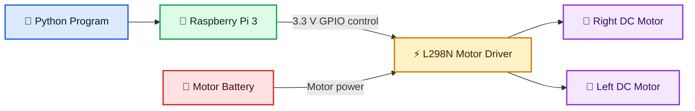
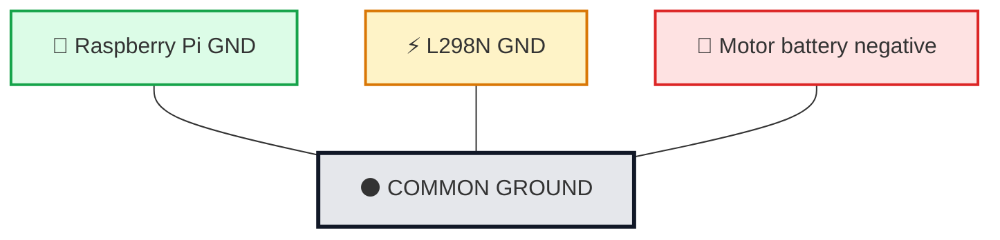
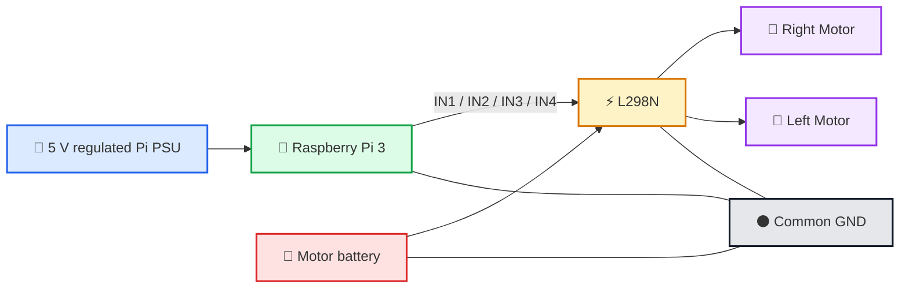
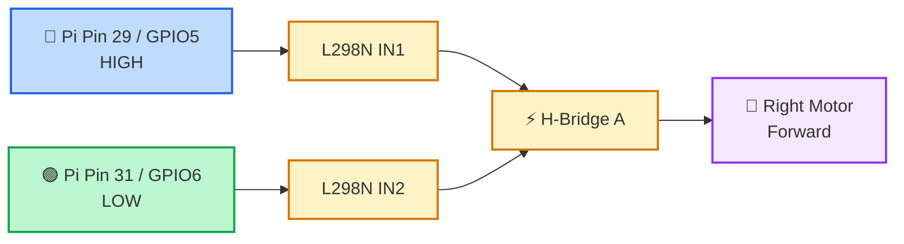
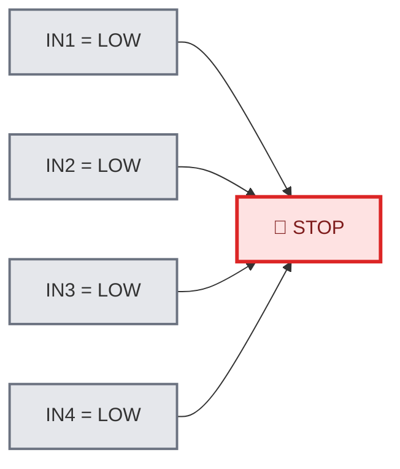
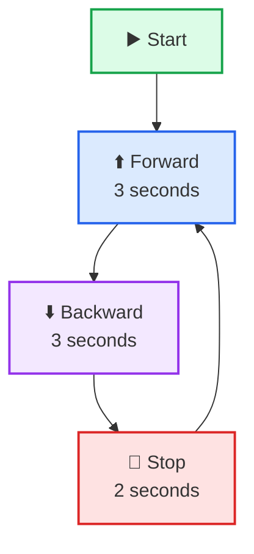
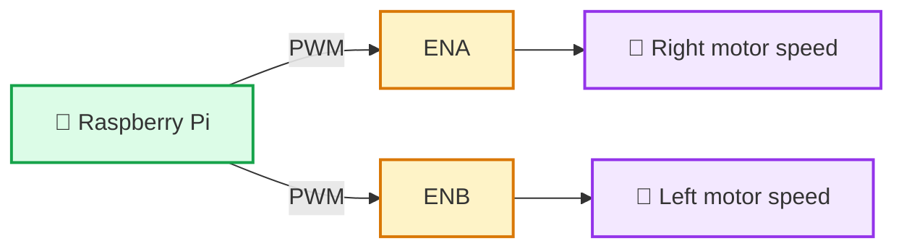
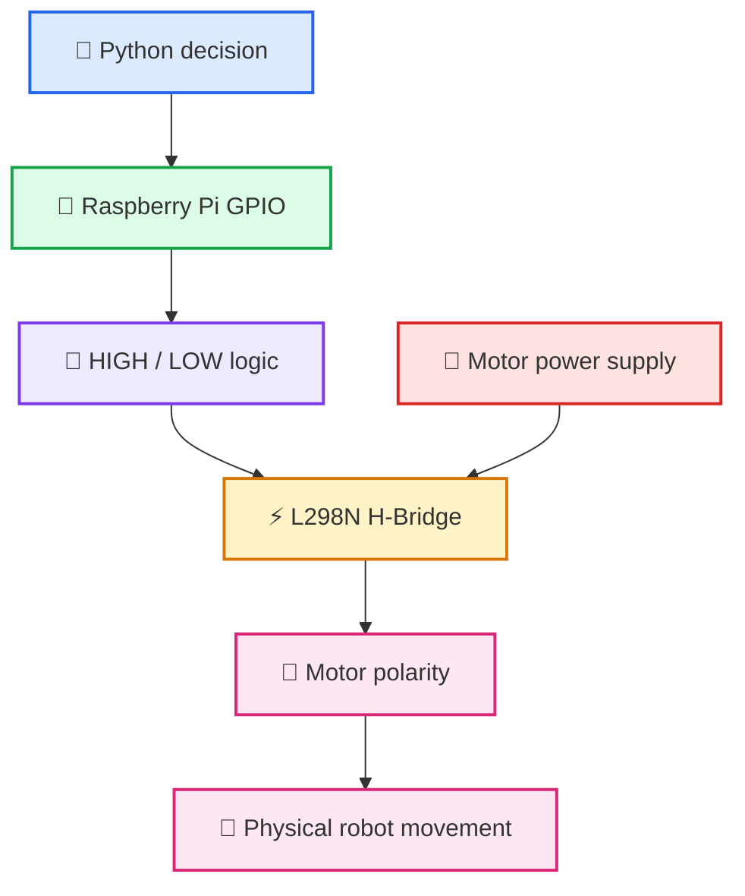
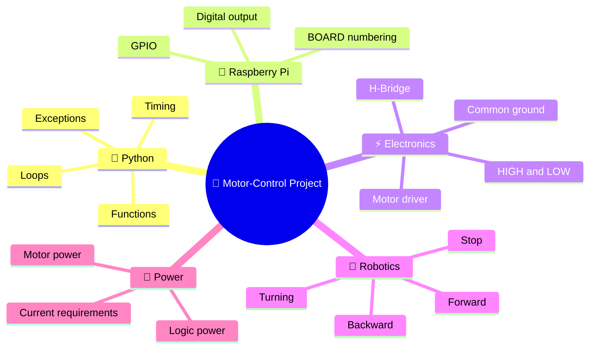
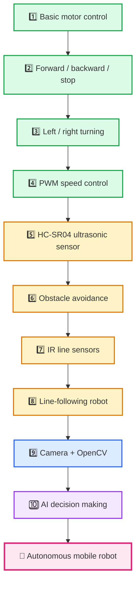

# 🤖 Raspberry Pi 3 + L298N + Two DC Motors

## 🌈 Complete Motor-Control Project with Visual Wiring Diagrams

> **Project goal:** Control two DC motors from a Raspberry Pi 3 Model B / Model B+ using Python and an L298N dual H-bridge motor driver.
>
> The robot repeatedly moves **forward for 3 seconds**, **backward for 3 seconds**, and then **stops for 2 seconds**.

---

## 🖼️ Complete Wiring Overview


> 🟡 **Important:** The image is a teaching overview. Always verify the labels printed on your own L298N module before connecting power, because module layouts can vary slightly between manufacturers.

---

# 🎯 1. What Are We Building?

We are building the basic drive system of a small mobile robot.

The Raspberry Pi is the **brain** 🧠. It runs Python and decides whether the robot should move forward, backward, or stop.

The L298N is the **motor-power interface** ⚡. It receives small logic signals from the Raspberry Pi and switches the larger current needed by the motors.

The motors are the **actuators** 🛞. They convert electrical energy into physical movement.



### 🧩 The four layers of the project

| Layer | Component | Job |
|---|---|---|
| 💻 Software | Python | Decides what the robot should do |
| 🧠 Controller | Raspberry Pi 3 | Converts Python commands into GPIO HIGH/LOW signals |
| ⚡ Power interface | L298N | Drives the motors using a separate motor supply |
| 🛞 Mechanical output | Two DC motors | Move the robot physically |

---

# 🧰 2. Components Required

- 🟢 Raspberry Pi 3 Model B or Raspberry Pi 3 Model B+
- 🔴 L298N dual H-bridge motor driver module
- 🛞 Two DC geared motors
- 🔋 Suitable DC motor battery/power supply
- 🔌 Raspberry Pi 5 V regulated power supply
- 🧵 Female-to-female or female-to-male jumper wires, depending on your module
- 💾 microSD card with Raspberry Pi OS
- 🐍 Python 3
- 📦 `RPi.GPIO` library
- 🧱 Robot chassis, wheels, and caster wheel if building a moving robot

---

# 🧠 3. Why Do We Need an L298N?

A Raspberry Pi GPIO pin is designed for **logic signals**, not for directly powering motors.

A GPIO pin works approximately like this:

```text
LOW  ≈ 0 V
HIGH ≈ 3.3 V
```

A DC motor normally needs much more current than a GPIO pin can safely provide.

So we should **not** do this:

```text
❌ Raspberry Pi GPIO ─────────► DC Motor
```

Instead, use a motor driver:

```text
✅ Raspberry Pi GPIO ─► L298N ─► DC Motor
                         ▲
                         │
                  Separate motor power
```

### ⚡ Think of the L298N as an electronic power switch

The Raspberry Pi says:

> “Motor A should rotate in this direction.”

The L298N then uses the motor battery to make that happen.

---

# 🔢 4. Very Important: BOARD vs BCM Numbering

Your Python program contains:

```python
GPIO.setmode(GPIO.BOARD)
```

This means your program uses the **physical pin numbers** printed by position on the 40-pin header.

For example:

```python
IN1 = 29
```

means:

> **Physical pin 29**, which happens to be **BCM GPIO5**.

It does **not** mean BCM GPIO29.

## 🎨 Your exact pin mapping

| Python name | Physical pin | BCM GPIO | L298N input | Purpose |
|---|---:|---:|---|---|
| 🔵 `IN1` | **29** | GPIO5 | IN1 | Right motor direction input 1 |
| 🟢 `IN2` | **31** | GPIO6 | IN2 | Right motor direction input 2 |
| 🟠 `IN3` | **32** | GPIO12 | IN3 | Left motor direction input 1 |
| 🟣 `IN4` | **33** | GPIO13 | IN4 | Left motor direction input 2 |
| ⚫ `GND` | 30 / 34 / 39 etc. | GND | GND | Common electrical reference |

---

# 🧷 5. Raspberry Pi 3 40-Pin Header

Below is a compact reference showing the complete 40-pin header.

```text
                 Raspberry Pi 3 GPIO Header
              Physical numbering - top view

          LEFT COLUMN                RIGHT COLUMN

       3.3V   ( 1)                 ( 2)  5V
       GPIO2  ( 3)                 ( 4)  5V
       GPIO3  ( 5)                 ( 6)  GND
       GPIO4  ( 7)                 ( 8)  GPIO14
       GND    ( 9)                 (10)  GPIO15
       GPIO17 (11)                 (12)  GPIO18
       GPIO27 (13)                 (14)  GND
       GPIO22 (15)                 (16)  GPIO23
       3.3V   (17)                 (18)  GPIO24
       GPIO10 (19)                 (20)  GND
       GPIO9  (21)                 (22)  GPIO25
       GPIO11 (23)                 (24)  GPIO8
       GND    (25)                 (26)  GPIO7
       GPIO0  (27)                 (28)  GPIO1
 🔵    GPIO5  (29)                 (30)  GND  ⚫
 🟢    GPIO6  (31)                 (32)  GPIO12 🟠
 🟣    GPIO13 (33)                 (34)  GND  ⚫
       GPIO19 (35)                 (36)  GPIO16
       GPIO26 (37)                 (38)  GPIO20
       GND    (39)                 (40)  GPIO21
```

### ⭐ Pins used by this project

```text
🔵 Pin 29 / GPIO5  ─────────► L298N IN1
🟢 Pin 31 / GPIO6  ─────────► L298N IN2
🟠 Pin 32 / GPIO12 ─────────► L298N IN3
🟣 Pin 33 / GPIO13 ─────────► L298N IN4
⚫ Any suitable Pi GND ──────► L298N GND
```

---

# 🔌 6. Complete Wiring Table

## 🧠 Raspberry Pi → L298N control wires

| Wire | Raspberry Pi | L298N |
|---|---|---|
| 🔵 Blue | Physical pin **29** / GPIO5 | IN1 |
| 🟢 Green | Physical pin **31** / GPIO6 | IN2 |
| 🟠 Orange | Physical pin **32** / GPIO12 | IN3 |
| 🟣 Purple | Physical pin **33** / GPIO13 | IN4 |
| ⚫ Black | Any suitable GND pin | GND |

## 🛞 L298N → motors

| L298N terminal | Connect to |
|---|---|
| OUT1 | Right motor terminal 1 |
| OUT2 | Right motor terminal 2 |
| OUT3 | Left motor terminal 1 |
| OUT4 | Left motor terminal 2 |

> 🟡 **Note:** “Right” and “left” depend on how your motors are physically mounted. If a wheel spins in the wrong direction, you can swap the two wires for that motor or change the software direction logic.

## 🔋 Motor power

| Motor supply | L298N |
|---|---|
| Battery `+` | `VIN`, `12V`, or motor-power input terminal |
| Battery `-` | `GND` |

Use a motor supply appropriate for the **rated voltage of your motors**. The terminal may be labeled `12V`, but that does not mean every motor should be powered at 12 V.

---

# ⚫ 7. Common Ground — One of the Most Important Concepts

The Raspberry Pi and L298N must have the same electrical reference.



Why?

The L298N has to understand what the Raspberry Pi means by `HIGH` and `LOW`.

Without a common ground, the control signals may become unreliable or may not work at all.

---

# 🔋 8. Recommended Power Architecture

For teaching and first experiments, use **separate regulated power for the Raspberry Pi and the motors**.



### 🚨 Safety rule

Never connect a 7 V, 9 V, or 12 V motor supply directly to a Raspberry Pi GPIO pin.

---

# ⚡ 9. How an H-Bridge Changes Motor Direction

A DC motor changes direction when the polarity across the motor is reversed.

The L298N contains two H-bridges:

```text
H-Bridge A: IN1 + IN2  ───► OUT1 + OUT2 ───► Motor A
H-Bridge B: IN3 + IN4  ───► OUT3 + OUT4 ───► Motor B
```

## ➡️ Motor A forward

```text
IN1 = HIGH
IN2 = LOW

OUT1  + ──────────────┐
                      │
                    [ MOTOR ]  →
                      │
OUT2  - ──────────────┘
```

## ⬅️ Motor A backward

```text
IN1 = LOW
IN2 = HIGH

OUT1  - ──────────────┐
                      │
                    [ MOTOR ]  ←
                      │
OUT2  + ──────────────┘
```

The same idea applies to `IN3` and `IN4` for Motor B.

---

# 🚦 10. H-Bridge Truth Tables

## Right motor: IN1 + IN2

| IN1 | IN2 | Typical result |
|---|---|---|
| LOW | LOW | 🛑 Stop/coast |
| HIGH | LOW | ⬆️ Direction A |
| LOW | HIGH | ⬇️ Direction B |
| HIGH | HIGH | 🧱 Stop/brake-style state depending on driver configuration |

## Left motor: IN3 + IN4

| IN3 | IN4 | Typical result |
|---|---|---|
| LOW | LOW | 🛑 Stop/coast |
| HIGH | LOW | ⬆️ Direction A |
| LOW | HIGH | ⬇️ Direction B |
| HIGH | HIGH | 🧱 Stop/brake-style state depending on driver configuration |

> 💡 “Direction A” becomes robot **forward** only after you physically mount and wire the motor in the expected orientation.

---

# 🐍 11. Your Python Program

```python
import time
import RPi.GPIO as GPIO

# GPIO settings
GPIO.setwarnings(False)
GPIO.setmode(GPIO.BOARD)

# Physical GPIO pin numbers because BOARD mode is used
IN1 = 29   # Right motor direction input 1
IN2 = 31   # Right motor direction input 2
IN3 = 32   # Left motor direction input 1
IN4 = 33   # Left motor direction input 2

# Setup pins as outputs
GPIO.setup(IN1, GPIO.OUT)
GPIO.setup(IN2, GPIO.OUT)
GPIO.setup(IN3, GPIO.OUT)
GPIO.setup(IN4, GPIO.OUT)

# -----------------------------
# Individual motor directions
# -----------------------------

def motor_a_forward():
    GPIO.output(IN1, GPIO.HIGH)
    GPIO.output(IN2, GPIO.LOW)


def motor_a_backward():
    GPIO.output(IN1, GPIO.LOW)
    GPIO.output(IN2, GPIO.HIGH)


def motor_b_forward():
    GPIO.output(IN3, GPIO.HIGH)
    GPIO.output(IN4, GPIO.LOW)


def motor_b_backward():
    GPIO.output(IN3, GPIO.LOW)
    GPIO.output(IN4, GPIO.HIGH)


# -----------------------------
# Whole robot movements
# -----------------------------

def forward():
    motor_a_forward()
    motor_b_forward()


def backward():
    motor_a_backward()
    motor_b_backward()


def stop():
    GPIO.output(IN1, GPIO.LOW)
    GPIO.output(IN2, GPIO.LOW)
    GPIO.output(IN3, GPIO.LOW)
    GPIO.output(IN4, GPIO.LOW)


# -----------------------------
# Main program
# -----------------------------

try:
    while True:
        print("Moving forward...")
        forward()
        time.sleep(3)

        print("Moving backward...")
        backward()
        time.sleep(3)

        print("Stopping...")
        stop()
        time.sleep(2)

except KeyboardInterrupt:
    print("Exiting program")
    stop()
    GPIO.cleanup()
```

---

# 🔍 12. Understanding the Code Step by Step

## 12.1 Importing the libraries

```python
import time
import RPi.GPIO as GPIO
```

`time` provides timing functions such as `time.sleep()`.

`RPi.GPIO` gives Python access to Raspberry Pi GPIO pins.

---

## 12.2 Disabling warnings

```python
GPIO.setwarnings(False)
```

This prevents repeated GPIO-use warnings from appearing while students rerun the program.

For production-quality software, you should still understand why warnings appear rather than simply ignoring every warning.

---

## 12.3 Selecting BOARD mode

```python
GPIO.setmode(GPIO.BOARD)
```

This tells Python:

> “Use physical header pin numbers.”

Therefore:

```text
29 means physical pin 29
31 means physical pin 31
32 means physical pin 32
33 means physical pin 33
```

---

# 🔵 13. Right Motor Control

## Forward

```python
def motor_a_forward():
    GPIO.output(IN1, GPIO.HIGH)
    GPIO.output(IN2, GPIO.LOW)
```

Visual signal flow:



## Backward

```python
def motor_a_backward():
    GPIO.output(IN1, GPIO.LOW)
    GPIO.output(IN2, GPIO.HIGH)
```

The two signals swap states, so the L298N reverses the voltage polarity across the motor.

---

# 🟣 14. Left Motor Control

## Forward

```python
def motor_b_forward():
    GPIO.output(IN3, GPIO.HIGH)
    GPIO.output(IN4, GPIO.LOW)
```

```text
🟠 Physical pin 32 / GPIO12 ─ HIGH ─► IN3
🟣 Physical pin 33 / GPIO13 ─ LOW  ─► IN4

                            L298N
                              │
                              ▼
                         Left motor
```

## Backward

```python
def motor_b_backward():
    GPIO.output(IN3, GPIO.LOW)
    GPIO.output(IN4, GPIO.HIGH)
```

Again, reversing the two digital states reverses the motor direction.

---

# ⬆️ 15. How `forward()` Works

```python
def forward():
    motor_a_forward()
    motor_b_forward()
```

Both wheels drive the robot forward.

```text
               ⬆️ FORWARD

          ┌─────────────────┐
          │      ROBOT      │
          │                 │
     🛞 ↻  │                 │  ↺ 🛞
          └─────────────────┘

      Left wheel        Right wheel
```

Because the motors are mounted on opposite sides, their visible shaft rotation may look opposite even though both wheels push the robot forward.

---

# ⬇️ 16. How `backward()` Works

```python
def backward():
    motor_a_backward()
    motor_b_backward()
```

```text
          ┌─────────────────┐
          │      ROBOT      │
          │                 │
     🛞 ↺  │                 │  ↻ 🛞
          └─────────────────┘

               ⬇️ BACKWARD
```

Both motors reverse direction.

---

# 🛑 17. How `stop()` Works

```python
def stop():
    GPIO.output(IN1, GPIO.LOW)
    GPIO.output(IN2, GPIO.LOW)
    GPIO.output(IN3, GPIO.LOW)
    GPIO.output(IN4, GPIO.LOW)
```

All four direction inputs become LOW.



---

# 🔁 18. Main Program Sequence

The line:

```python
while True:
```

creates an infinite loop.



### ⏱️ Timeline

| Time | Robot action |
|---:|---|
| 0–3 s | ⬆️ Forward |
| 3–6 s | ⬇️ Backward |
| 6–8 s | 🛑 Stop |
| 8–11 s | ⬆️ Forward |
| 11–14 s | ⬇️ Backward |
| 14–16 s | 🛑 Stop |
| ... | 🔁 Repeat |

---

# ⌨️ 19. What Happens When You Press Ctrl+C?

The program contains:

```python
except KeyboardInterrupt:
    print("Exiting program")
    stop()
    GPIO.cleanup()
```

So pressing `Ctrl+C` causes:


This is good practice because you do not want the motors continuing to run after the program is interrupted.

---

# 🧹 20. What Does `GPIO.cleanup()` Do?

```python
GPIO.cleanup()
```

releases the GPIO resources used by the program and returns the configured pins toward their normal input/default state.

It helps avoid leaving control pins active after your program has finished.

---

# 🎚️ 21. ENA and ENB on the L298N

Most L298N modules have two enable pins:

```text
ENA → Motor channel A enable
ENB → Motor channel B enable
```

A common module layout looks conceptually like:

```text
ENA   IN1   IN2       IN3   IN4   ENB
 │     │     │         │     │     │
 ▼     ▼     ▼         ▼     ▼     ▼
┌────────────────────────────────────┐
│              L298N                 │
└────────────────────────────────────┘
```

For a simple beginner project, ENA and ENB often have jumpers installed, keeping both motor channels enabled.

### 🚀 Later: speed control

If you remove the enable jumpers and drive ENA/ENB with PWM-capable GPIO signals, you can control motor speed.



This can support speeds such as:

```text
25%  ▓▓░░░░░░
50%  ▓▓▓▓░░░░
75%  ▓▓▓▓▓▓░░
100% ▓▓▓▓▓▓▓▓
```

---

# ↩️ 22. Turning the Robot

Your current code supports forward, backward, and stop. The same hardware can also turn.

## ↖️ Left turn

A simple turn can be made by stopping the left wheel and moving the right wheel.

```text
Left motor  = STOP
Right motor = FORWARD

           ↖️
       ┌─────────┐
       │  ROBOT  │
       └─────────┘
```

A sharper pivot turn can be made by running the two motors in opposite directions.

```text
Left motor  = BACKWARD
Right motor = FORWARD

          ↺
      [ ROBOT ]
```

## ↗️ Right turn

```text
Left motor  = FORWARD
Right motor = BACKWARD

      [ ROBOT ]
          ↻
```

---

# 🧭 23. Complete Software-to-Movement Flow



This project therefore teaches an important embedded-systems principle:

> **Software decisions become electrical signals, electrical signals control power electronics, and power electronics create physical movement.**

---

# 🚨 24. Electrical Safety and Good Practice

> [!WARNING]
> **Do not connect motor battery voltage directly to Raspberry Pi GPIO pins.** Raspberry Pi GPIO uses 3.3 V logic.

> [!IMPORTANT]
> Connect the Raspberry Pi ground and L298N ground together so that the logic signals have a common reference.

> [!CAUTION]
> Always verify battery voltage, motor voltage rating, and L298N terminal labels before switching power on.

### ✅ Recommended first-test procedure

1. Switch all power **off**.
2. Check physical pin numbers 29, 31, 32, and 33.
3. Confirm the Pi is using `GPIO.BOARD` mode.
4. Confirm Raspberry Pi GND is connected to L298N GND.
5. Confirm Motor A is connected only to OUT1/OUT2.
6. Confirm Motor B is connected only to OUT3/OUT4.
7. Confirm motor battery polarity.
8. Place the robot on a stand so the wheels are **off the table**.
9. Power the Raspberry Pi.
10. Power the motor driver.
11. Run the Python program.
12. Observe each wheel direction.
13. Press `Ctrl+C` immediately if anything is unexpected.

---

# 🧪 25. Common Problems and Troubleshooting

## Problem 1 — One motor rotates in the wrong direction

### Symptom

You call `forward()`, but the robot spins instead of moving straight.

### Solution

Either:

- swap the two wires for that motor at the L298N output, **or**
- reverse the HIGH/LOW logic for that motor in software.

---

## Problem 2 — Motors do not move

Check:

- Motor battery is connected and charged
- L298N power indicator is on
- ENA and ENB jumpers are fitted if you are not controlling enable with GPIO
- Motor wires are secure
- Common ground is connected
- Correct physical GPIO pins are used

---

## Problem 3 — Raspberry Pi restarts when motors start

This often indicates a power problem.

Possible causes:

- motors drawing large startup current
- unstable power supply
- attempting to power everything from an unsuitable single source
- electrical noise

Using a proper regulated Pi supply and separate motor supply is a good teaching arrangement.

---

## Problem 4 — Code uses the wrong pins

Your program uses:

```python
GPIO.setmode(GPIO.BOARD)
```

So this is correct:

```text
29 → Physical pin 29
31 → Physical pin 31
32 → Physical pin 32
33 → Physical pin 33
```

Do not accidentally interpret these as BCM numbers.

---

# 🎓 26. What Students Learn from This Exercise

Students are not only learning how to make wheels rotate. They are learning several fundamental embedded-systems concepts.



### Key learning outcomes

After completing this project, students should be able to:

- explain why a motor driver is required
- distinguish physical pin numbering from BCM numbering
- configure Raspberry Pi GPIO pins as outputs
- send HIGH and LOW signals from Python
- explain the basic operation of an H-bridge
- reverse DC motor direction
- understand separate logic and motor power
- explain why common ground is necessary
- organize movement commands into Python functions
- stop and clean up GPIO safely

---

# 🚀 27. Suggested Learning Roadmap After This Project



---

# 🏭 28. Why This Matters in Real Robotics

The same high-level pattern appears in many real machines:

```text
Software / Algorithm
        ↓
Controller
        ↓
Motor Driver
        ↓
Electric Motor
        ↓
Physical Motion
```

You will see this architecture in:

- 🤖 mobile robots
- 🏭 AGVs
- 📦 warehouse robots
- 🛒 autonomous carts
- 🚜 small agricultural robots
- 🧪 laboratory automation
- 🏫 educational robotics platforms

The hardware may become more advanced than an L298N, but the core idea remains similar.

---

# 📝 29. Mini Classroom Questions

1. Why should a Raspberry Pi GPIO pin not power a DC motor directly?
2. What is the purpose of the L298N?
3. What is the difference between BOARD and BCM numbering?
4. Which physical Raspberry Pi pin is used for `IN1` in this project?
5. Why do the Raspberry Pi and motor driver need common ground?
6. What happens when IN1 is HIGH and IN2 is LOW?
7. How can you reverse a DC motor?
8. What is the purpose of ENA and ENB?
9. Why is `GPIO.cleanup()` useful?
10. How could you extend this project to control speed?

---

# 🏁 30. Final Project Summary

Our complete system is:

```text
┌───────────────────────────────────────────────────────────┐
│                  🤖 ROBOT MOTOR SYSTEM                    │
├───────────────────────────────────────────────────────────┤
│                                                           │
│  🐍 Python                                                │
│      │                                                    │
│      ▼                                                    │
│  🧠 Raspberry Pi 3                                       │
│      │                                                    │
│      │ GPIO5 / GPIO6 / GPIO12 / GPIO13                   │
│      ▼                                                    │
│  ⚡ L298N Dual H-Bridge                                   │
│      ▲                                                    │
│      │                                                    │
│  🔋 Separate motor supply                                 │
│      │                                                    │
│      ├──────────────► 🛞 Right motor                      │
│      │                                                    │
│      └──────────────► 🛞 Left motor                       │
│                                                           │
│  ⚫ Raspberry Pi GND + L298N GND = COMMON GROUND          │
│                                                           │
└───────────────────────────────────────────────────────────┘
```

### ⭐ Final concept

> **Python decides → Raspberry Pi signals → L298N switches motor power → Motors move the robot.**

This basic project is the foundation for building increasingly intelligent Raspberry Pi robots using sensors, computer vision, and AI.

---

## 📁 Repository structure

```text
raspberry_pi_3_motor_control/
│
├── README.md
│
└── assets/
    └── raspberry_pi_l298n_complete_diagram.png
```

When you upload the folder to GitHub, keep the `assets` folder next to `README.md`. GitHub will then display the image automatically using this line:

```markdown

```

---

**Course topic:** Raspberry Pi GPIO, motor drivers, H-bridges, and basic mobile robot control  
**Platform:** Raspberry Pi 3 Model B / B+  
**Programming language:** Python 3  
**Motor driver:** L298N dual H-bridge
