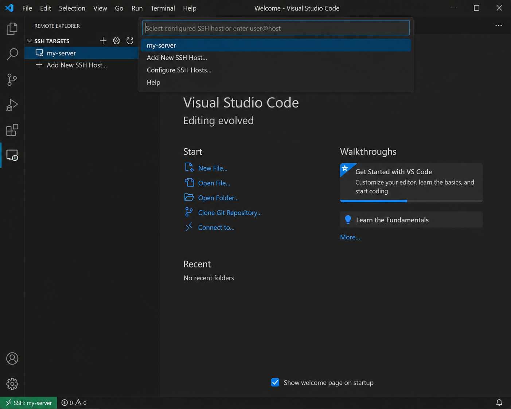

# Opgave 1: Connect SSH in Visual Studio Code

## Connect SSH in Visual Studio Code (Complete Assignment)

### Objective

After completing this assignment, the student should be able to:

- Create and use SSH keys.
- Configure the `~/.ssh/config` file.
- Install and use the **Remote - SSH** extension in Visual Studio Code to connect to a remote server.
- Open a remote folder in VS Code and run terminal commands through SSH.
- Troubleshoot common SSH-related issues.

---

## Prerequisites (What You Need Ready)

Before starting, make sure you have:

- A local machine with **Visual Studio Code** installed.
- An internet connection.
- A remote server with SSH access (IP address/hostname and username), for example:
  - A Linux VM
  - A VPS (Virtual Private Server)
- Access to the remote server's `~/.ssh/authorized_keys` file (this can be updated by the server administrator if necessary).

---

## Materials / Tools

- **Visual Studio Code** (latest version)
- VS Code extension: **Remote - SSH** (Microsoft)
- A terminal application:
  - Bash
  - PowerShell
  - macOS Terminal
  - WSL (Windows Subsystem for Linux)
- *(Optional)* Git client

---

## Video Guide

📺 **YouTube Tutorial:**

[How to Connect SSH in VS Code](#)

---
