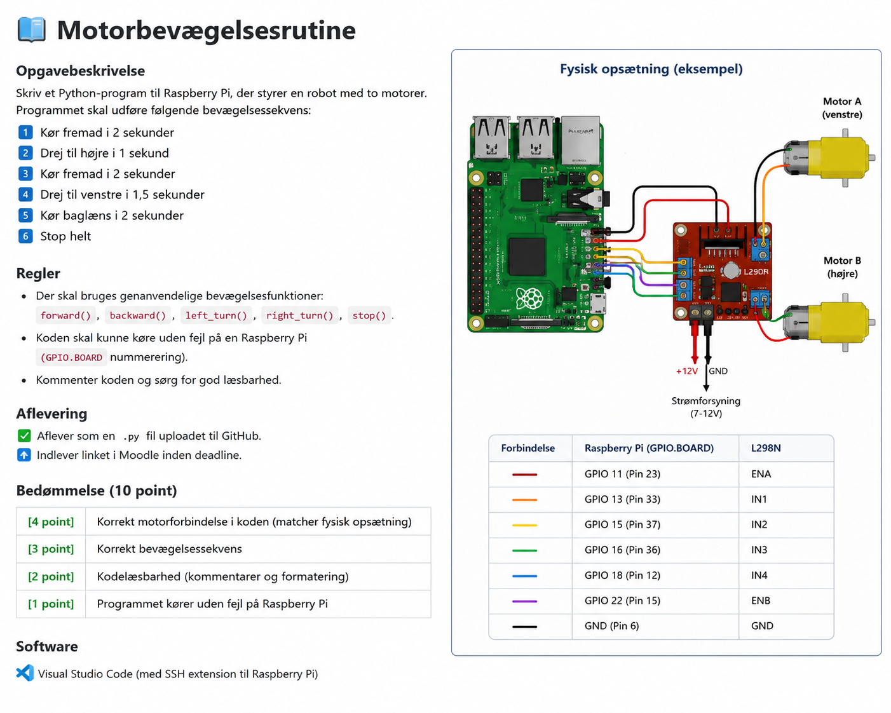

# 📘 Motorbevægelsesrutine

## Opgavebeskrivelse

Skriv et Python-program til Raspberry Pi, der styrer en robot med to motorer.

Programmet skal udføre følgende bevægelsessekvens:

1. Kør fremad i 2 sekunder
2. Drej til højre i 1 sekund
3. Kør fremad i 2 sekunder
4. Drej til venstre i 1,5 sekunder
5. Kør baglæns i 2 sekunder
6. Stop helt

---

## Regler

* Der skal bruges genanvendelige bevægelsesfunktioner:

  * `forward()`
  * `backward()`
  * `left_turn()`
  * `right_turn()`
  * `stop()`

* Koden skal kunne køre uden fejl på en Raspberry Pi med **GPIO.BOARD**-nummerering.

* Kommentér koden og sørg for god læsbarhed.

---

## Aflevering

* Aflever som en `.py`-fil uploadet til GitHub.
* Indlever GitHub-linket i Moodle inden deadline.

---

## Bedømmelse (10 point) - der er ikke aktual Bedømmelse

| Kriterium                                                   | Point   |
| ----------------------------------------------------------- | ------- |
| Korrekt motorforbindelse i koden (matcher fysisk opsætning) | 4 point |
| Korrekt bevægelsessekvens                                   | 3 point |
| Kodelæsbarhed (kommentarer og formatering)                  | 2 point |
| Programmet kører uden fejl på Raspberry Pi                  | 1 point |

---

## Software

* Visual Studio Code (med **Remote - SSH**-udvidelsen til Raspberry Pi)

---

## Læringsmål

Efter gennemførelse af denne opgave skal den studerende kunne:

* Styre DC-motorer fra en Raspberry Pi ved hjælp af GPIO-pins.
* Strukturere kode ved hjælp af genanvendelige funktioner.
* Anvende tidsstyring med Python-modulet `time`.
* Teste og fejlfinde robotbevægelser.
* Arbejde med GitHub til versionsstyring og aflevering af kode.

---

## Forventet Resultat

Når programmet køres, skal robotten udføre den angivne bevægelsessekvens og derefter stoppe helt uden fejl.

# Autoriserede rettigheder af Zuhair Haroon Khan