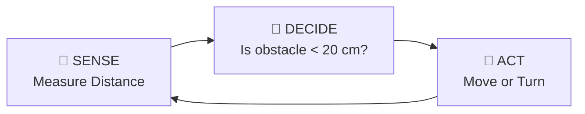
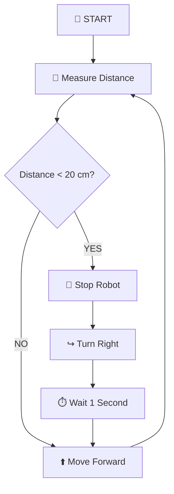
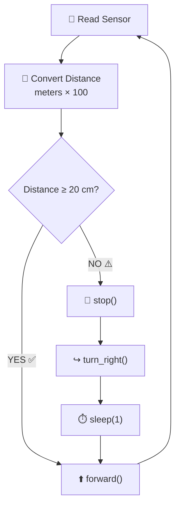
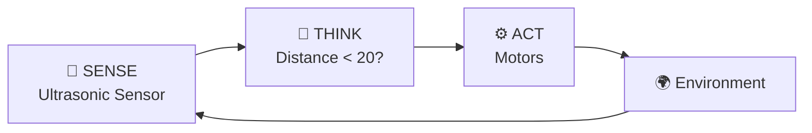
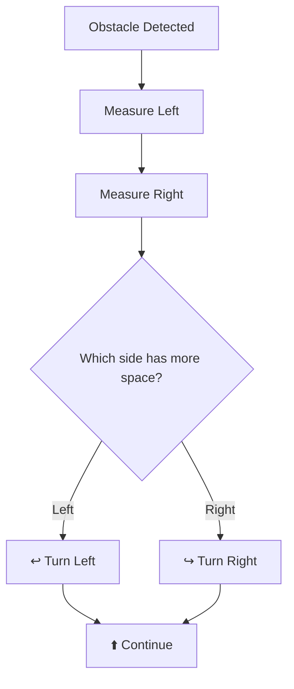
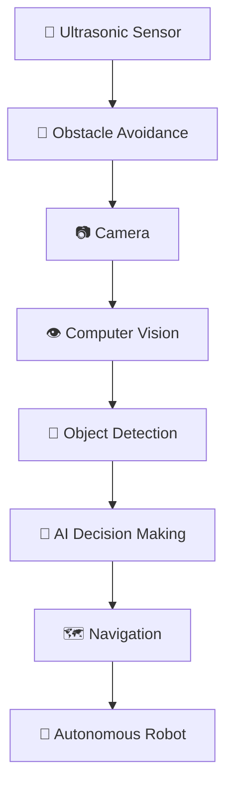

# 🤖 Basic Obstacle Avoidance Robot


---

# 🎯 Objective

The goal of this assignment is to program a robot that can **detect and avoid obstacles automatically** using an ultrasonic distance sensor.

The robot should normally move forward.

When an obstacle is detected at a distance of less than:

```text
20 cm
```

the robot must:

```text
🛑 Stop
   ↓
↪️ Turn Right
   ↓
⏱️ Wait 1 Second
   ↓
⬆️ Continue Forward
```

This process must run continuously.

---

# 🧠 Main Idea

The robot follows a simple:

## Sense → Decide → Act

architecture.



The robot continuously observes its environment and makes a simple decision.

---

# 🧰 Tools and Components

## 💻 Software

| Tool | Purpose |
|---|---|
| Python | Robot programming |
| GPIO Zero | Sensor control |
| Raspberry Pi OS | Operating system |
| VS Code / Terminal | Run Python program |

---

## 🔧 Hardware

You may need:

- 🤖 Raspberry Pi robot
- 📡 HC-SR04 ultrasonic sensor
- ⚙️ DC motors
- 🔴 Motor driver
- 🔋 Motor power supply
- 🧵 Jumper wires
- 🛡️ Resistors for ECHO voltage divider
- Raspberry Pi

---

# 📡 Ultrasonic Sensor

The ultrasonic sensor measures the distance between the robot and an object.

A typical HC-SR04 sensor contains:

```text
        HC-SR04

    ┌─────────────────┐
    │   ◉         ◉   │
    │                 │
    │ VCC TRIG ECHO GND
    └─────────────────┘
```

The two circular components are responsible for sending and receiving ultrasonic sound.

---

# 🔊 How Ultrasonic Distance Measurement Works

The sensor sends an ultrasonic sound pulse.

```text
Robot Sensor

     )))))))))))))))))))

               OBJECT
                 ███
```

The sound hits an object.

```text
Sensor  ───────────────► Object
```

The sound then returns.

```text
Sensor  ◄─────────────── Object
```

The sensor measures how long the complete journey takes.

---

# 🧮 Distance Calculation

Conceptually:

```text
Distance =
Speed of Sound × Travel Time
────────────────────────────
             2
```

We divide by `2` because the sound travels:

```text
Sensor → Object → Sensor
```

---

# 📏 DistanceSensor in Python

In this assignment we use:

```python
from gpiozero import DistanceSensor
```

Example:

```python
sensor = DistanceSensor(
    echo=27,
    trigger=4
)
```

The sensor's `.distance` property returns the distance in:

```text
meters
```

Therefore we convert it into centimeters.

```python
distance_cm = sensor.distance * 100
```

Example:

```text
0.35 meters
     ×
100
     ↓
35 centimeters
```

---

# 🔌 Example Sensor Connections

Using the GPIO numbers from the previous ultrasonic sensor exercises:

| HC-SR04 | Raspberry Pi |
|---|---|
| VCC | 5V |
| TRIG | GPIO4 |
| ECHO | GPIO27 through voltage divider |
| GND | GND |

---

# ⚠️ Important ECHO Safety

The HC-SR04 ECHO pin can output approximately:

```text
5V
```

Raspberry Pi GPIO works at approximately:

```text
3.3V
```

Therefore, do **not** connect a standard HC-SR04 ECHO output directly to a Raspberry Pi GPIO pin.

Use an appropriate voltage divider or level shifter.

Example concept:

```text
HC-SR04 ECHO
      │
     1kΩ
      │
      ├──────────► Raspberry Pi GPIO
      │
     2kΩ
      │
     GND
```

---

# 🚗 Required Robot Movement Functions

Your program should use the following functions:

```python
forward()
stop()
turn_right()
```

---

## ⬆️ `forward()`

Moves both robot wheels forward.

```text
LEFT MOTOR             RIGHT MOTOR

     ↑                      ↑
  FORWARD                 FORWARD

        ┌──────────────┐
        │    ROBOT     │
        └──────────────┘
               ↑
            FORWARD
```

---

## 🛑 `stop()`

Stops both motors.

```text
LEFT MOTOR             RIGHT MOTOR

    STOP                   STOP
     ⏹                      ⏹

        ┌──────────────┐
        │    ROBOT     │
        │     STOP     │
        └──────────────┘
```

---

## ↪️ `turn_right()`

The robot turns toward the right.

One simple approach is:

```text
LEFT MOTOR             RIGHT MOTOR

   FORWARD                 STOP
      ↑                     ⏹

        ┌──────────────┐
        │    ROBOT     │
        └──────────────┘
                ↗
            TURN RIGHT
```

---

# 🧠 Decision Rule

The robot uses one important threshold:

```text
20 cm
```

The decision is:

| Distance | Robot Action |
|---:|---|
| `>= 20 cm` | ⬆️ Move Forward |
| `< 20 cm` | 🛑 Stop + ↪️ Turn Right |

---

# 🌈 Robot Decision Diagram



---

# 🤖 Expected Robot Behavior

The normal behavior should be:

```text
                 START
                   │
                   ▼
            Measure Distance
                   │
                   ▼
           Is path clear?
              /        \
            YES         NO
             │           │
             ▼           ▼
         FORWARD        STOP
             │           │
             │           ▼
             │       TURN RIGHT
             │           │
             │        1 second
             │           │
             └───────────┘
                   │
                   ▼
                 REPEAT
```

---

# 🧪 Assignment

## Basic Obstacle Avoidance Robot

Your task is to develop a Python program that controls a robot using an ultrasonic distance sensor.

The program must continuously check the distance in front of the robot.

---

# ✅ Requirement 1 — Initialize the Sensor

Create a `DistanceSensor` object.

Example:

```python
from gpiozero import DistanceSensor

sensor = DistanceSensor(
    echo=27,
    trigger=4
)
```

---

# ✅ Requirement 2 — Measure Distance

Read the sensor:

```python
sensor.distance
```

Convert the result from meters to centimeters.

```python
distance_cm = sensor.distance * 100
```

Display the result.

Example:

```text
Distance: 45.7 cm
```

---

# ✅ Requirement 3 — Move Forward

If:

```text
distance >= 20 cm
```

the robot must continue forward.

Conceptually:

```python
if distance_cm >= 20:
    forward()
```

---

# ✅ Requirement 4 — Detect an Obstacle

If:

```text
distance < 20 cm
```

the robot must identify the object as an obstacle.

Example:

```text
⚠️ OBSTACLE DETECTED
Distance: 14.8 cm
```

---

# ✅ Requirement 5 — Stop

The robot must stop before attempting to turn.

```text
Obstacle
    │
    ▼
🛑 STOP
```

---

# ✅ Requirement 6 — Turn Right

After stopping:

```text
↪️ Turn Right
```

The robot must turn for approximately:

```text
1 second
```

---

# ✅ Requirement 7 — Continue Forward

After completing the turn:

```text
Turn Right
     │
     ▼
Forward
```

The robot begins searching for obstacles again.

---

# ✅ Requirement 8 — Continuous Loop

The robot must continuously repeat the process.

Use:

```python
while True:
```

Conceptually:

```text
Measure
   ↓
Decide
   ↓
Move
   ↓
Measure
   ↓
Decide
   ↓
Move
   ↓
...
```

---

# 🐍 Python Starter Code

Complete the missing sections marked with:

```text
TODO
```

```python
from gpiozero import DistanceSensor
from time import sleep


# -------------------------------------
# Ultrasonic Sensor
# -------------------------------------

sensor = DistanceSensor(
    echo=27,
    trigger=4
)


# -------------------------------------
# Robot Movement Functions
# -------------------------------------

def forward():
    """
    Move both motors forward.
    """

    # TODO:
    # Add your motor control code here

    print("Robot moving forward")


def stop():
    """
    Stop both motors.
    """

    # TODO:
    # Add your motor stop code here

    print("Robot stopped")


def turn_right():
    """
    Turn the robot toward the right.
    """

    # TODO:
    # Add your right-turn motor code here

    print("Robot turning right")


# -------------------------------------
# Main Program
# -------------------------------------

try:

    while True:

        # Measure distance
        distance_cm = sensor.distance * 100

        print(
            f"Distance: {distance_cm:.1f} cm"
        )

        # ---------------------------------
        # Decision Making
        # ---------------------------------

        if distance_cm >= 20:

            # TODO:
            # Move robot forward
            pass

        else:

            print("Obstacle detected!")

            # TODO:
            # Stop robot

            # TODO:
            # Turn right

            # Turn for approximately 1 second
            sleep(1)

            # TODO:
            # Continue forward

        # Small sensor-reading delay
        sleep(0.1)


except KeyboardInterrupt:

    print("\nProgram stopped by user")

    stop()
```

---

# 🧠 Your Main Decision Algorithm

Your final logic should follow this pseudocode:

```text
START

Initialize ultrasonic sensor

WHILE True

    Measure distance

    Convert meters → centimeters

    IF distance >= 20 cm

        Move Forward

    ELSE

        Stop Robot

        Turn Right

        Wait 1 Second

        Continue Forward

END WHILE
```

---

# 🌟 Visual Algorithm



---

# 🧪 Test Scenario 1 — Clear Path

Suppose:

```text
Distance = 75 cm
```

The decision should be:

```text
75 >= 20

     TRUE
       │
       ▼
⬆️ MOVE FORWARD
```

Expected terminal output:

```text
Distance: 75.0 cm
Robot moving forward
```

---

# 🧪 Test Scenario 2 — Obstacle Detected

Suppose:

```text
Distance = 15 cm
```

The decision becomes:

```text
15 < 20

     TRUE
       │
       ▼
⚠️ OBSTACLE
       │
       ▼
🛑 STOP
       │
       ▼
↪️ TURN RIGHT
       │
       ▼
⬆️ FORWARD
```

---

# 🧪 Test Scenario 3 — Border Value

Suppose:

```text
Distance = 20 cm
```

According to the requirement:

```text
distance >= 20
```

the robot should:

```text
⬆️ MOVE FORWARD
```

---

# 📊 Example Terminal Output

```text
Distance: 68.2 cm
Robot moving forward

Distance: 52.7 cm
Robot moving forward

Distance: 31.4 cm
Robot moving forward

Distance: 18.6 cm
Obstacle detected!
Robot stopped
Robot turning right

Distance: 42.3 cm
Robot moving forward
```

---

# 🧭 Real Robot Example

Imagine the robot sees the following environment:

```text
START

 🤖
 │
 │
 │
 ▼

        ███████████
        █ OBSTACLE█
        ███████████
```

The robot approaches:

```text
 🤖 ─────────────► █████
```

At approximately:

```text
< 20 cm
```

the robot stops.

```text
 🤖       █████
 STOP
```

Then turns right:

```text
          █████
 🤖 ↘
```

And continues:

```text
          █████

             🤖
              │
              ▼
```

---

# 🧩 Sense → Think → Act

This assignment introduces one of the most important architectures in autonomous robotics.



This creates a **feedback loop**.

---

# 🔄 Feedback Loop

The robot does not simply follow a fixed movement sequence.

Instead:

```text
Environment
     │
     ▼
Sensor
     │
     ▼
Python
     │
     ▼
Decision
     │
     ▼
Motors
     │
     ▼
Robot Movement
     │
     ▼
Environment
```

This is the beginning of:

# 🤖 Autonomous Behavior

---

# 🎯 Learning Outcomes

After completing this assignment, students should be able to:

### 📡 Sensors

- ✅ Explain how an ultrasonic sensor works.
- ✅ Read distance measurements.
- ✅ Convert meters to centimeters.
- ✅ Understand TRIG and ECHO.

### 🐍 Python

- ✅ Use `while True`.
- ✅ Use `if / else`.
- ✅ Create Python functions.
- ✅ Use sensor values in conditions.
- ✅ Use `KeyboardInterrupt`.
- ✅ Structure a robot-control program.

### 🤖 Robotics

- ✅ Move a robot forward.
- ✅ Stop a robot.
- ✅ Turn a robot.
- ✅ Detect obstacles.
- ✅ Connect sensor information to motor behavior.
- ✅ Implement simple autonomous navigation.

---

# 🏆 Grading Breakdown — 10 Points

| Criteria | Points | Self Check |
|---|---:|---|
| 📏 Correct distance measurement and conversion | 3 | ☐ |
| 🤖 Correct motor response: stop, turn, resume | 3 | ☐ |
| ↪️ Smooth one-second right turn | 2 | ☐ |
| 📝 Readable, structured and commented code | 2 | ☐ |
| **TOTAL** | **10** | |

---

# 📏 1. Distance Measurement — 3 Points

The program must correctly:

```text
Read sensor.distance
        ↓
Convert meters to centimeters
        ↓
Display distance
```

Expected:

```python
distance_cm = sensor.distance * 100
```

---

# 🤖 2. Motor Response — 3 Points

When an obstacle is detected:

```text
Obstacle < 20 cm
       │
       ▼
      STOP
       │
       ▼
   TURN RIGHT
       │
       ▼
    FORWARD
```

---

# ↪️ 3. Smooth Turn — 2 Points

The right turn should last approximately:

```text
1 second
```

A very short turn may cause the robot to repeatedly detect the same obstacle.

A controlled turn helps the robot choose a new direction.

---

# 📝 4. Code Readability — 2 Points

Your program should contain:

- meaningful function names,
- comments,
- good indentation,
- clear variables,
- separate sections for sensor and movement,
- understandable decision logic.

---

# ⭐ Challenge Level 1 — Change the Safety Distance

Modify:

```text
20 cm
```

to:

```text
30 cm
```

Observe how the robot behaves.

### Question

Does the robot react earlier or later?

---

# ⭐⭐ Challenge Level 2 — Random Turning

Instead of always turning right:

```text
Obstacle
    │
    ▼
Random Decision
   /       \
  ▼         ▼
LEFT      RIGHT
```

The robot could randomly select a direction.

---

# ⭐⭐⭐ Challenge Level 3 — Add Left and Right Decisions

Create:

```python
turn_left()
turn_right()
```

Then design logic that chooses between them.

---

# ⭐⭐⭐⭐ Challenge Level 4 — Multiple Distance Zones

Instead of only one threshold, create three zones.

| Distance | Behavior |
|---:|---|
| `> 50 cm` | 🟢 Fast Forward |
| `20–50 cm` | 🟡 Slow Forward |
| `< 20 cm` | 🔴 Stop + Turn |

Visual concept:

```text
0 cm          20 cm            50 cm
│──────────────│────────────────│────────►
     🔴              🟡              🟢
   DANGER          CAUTION          CLEAR
```

---

# ⭐⭐⭐⭐⭐ Challenge Level 5 — Smarter Obstacle Avoidance

Later, the ultrasonic sensor can be mounted on a servo motor.

```text
             📡
             │
        SERVO SENSOR
        /     |     \
       /      |      \
    LEFT    FRONT    RIGHT
```

The robot could measure:

```text
Left Distance
Front Distance
Right Distance
```

Then select the direction with the most available space.

---

# 🧠 Smarter Decision Example



This would be an important step toward more advanced autonomous navigation.

---

# 🎥 Live Demo

During the classroom demonstration:

### Demo 1

Test only the sensor.

```text
📡 Sensor
   ↓
Distance
   ↓
Terminal
```

---

### Demo 2

Test only movement.

```text
forward()

stop()

turn_right()
```

---

### Demo 3

Combine:

```text
📡 Sensor
   +
⚙️ Motors
   +
🐍 Python
   =
🤖 Obstacle Avoidance Robot
```

---

# 🧪 Recommended Testing Procedure

Do not immediately place the robot on the floor at full movement.

Test step by step.

### Step 1

Raise the robot so wheels can rotate safely.

### Step 2

Test:

```text
forward()
```

### Step 3

Test:

```text
stop()
```

### Step 4

Test:

```text
turn_right()
```

### Step 5

Test ultrasonic measurements.

### Step 6

Combine sensor + motors.

### Step 7

Place robot on a clear floor.

---

# ⚠️ Safety Checklist

Before running the robot:

- [ ] Motor wiring checked.
- [ ] Ultrasonic sensor wiring checked.
- [ ] ECHO voltage protection installed.
- [ ] Motor driver connected correctly.
- [ ] Ground connections checked.
- [ ] Robot has enough free floor space.
- [ ] No robot testing near table edges.
- [ ] Emergency stop is available with `Ctrl + C`.

---

# 🧠 Reflection Questions

### Question 1

Why do we multiply:

```python
sensor.distance * 100
```

---

### Question 2

What happens when the distance is exactly:

```text
20 cm
```

---

### Question 3

Why should the robot stop before turning?

---

### Question 4

Why do we use:

```python
while True:
```

---

### Question 5

What problem could occur if the robot turns for only:

```text
0.05 seconds
```

---

### Question 6

What would happen if the threshold changed from:

```text
20 cm
```

to:

```text
50 cm
```

---

### Question 7

How could two ultrasonic sensors improve obstacle avoidance?

---

### Question 8

How could a camera improve this system?

---

# 🚀 From Obstacle Avoidance to Autonomous Robotics

This assignment represents an important progression:

```text
Motor Control
     │
     ▼
Robot Movement
     │
     ▼
Ultrasonic Sensor
     │
     ▼
Distance Measurement
     │
     ▼
Decision Making
     │
     ▼
Obstacle Avoidance
     │
     ▼
Autonomous Navigation
```

---

# 🤖 Future Development

Later the system can be extended with:



---

# 🏁 Final Goal

By completing this assignment, you move from:

```text
Robot follows commands
```

toward:

```text
Robot senses environment
        ↓
Robot makes decision
        ↓
Robot changes behavior
```

That is one of the fundamental ideas behind an:

# 🤖 Autonomous Robot

---

## 📚 Technologies

`Python` • `Raspberry Pi` • `GPIO Zero` • `HC-SR04` • `Ultrasonic Sensor` • `Motor Control` • `Obstacle Avoidance` • `Autonomous Robotics`

---

> ### 💡 Remember
>
> **Sense → Decide → Act → Repeat**
>
> This simple loop is the foundation of many autonomous robotic systems.

---

## 🤖 Autonomous Robot with Python and AI

**Sense → Think → Move → Learn**