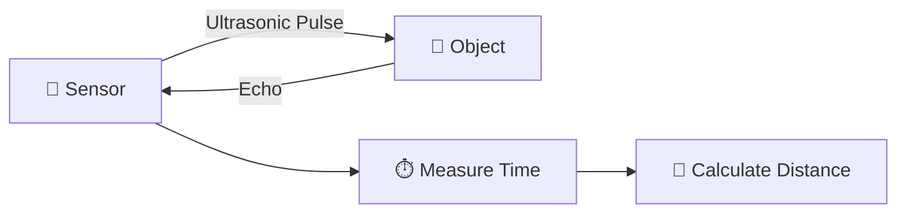
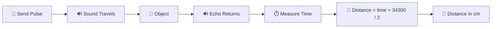
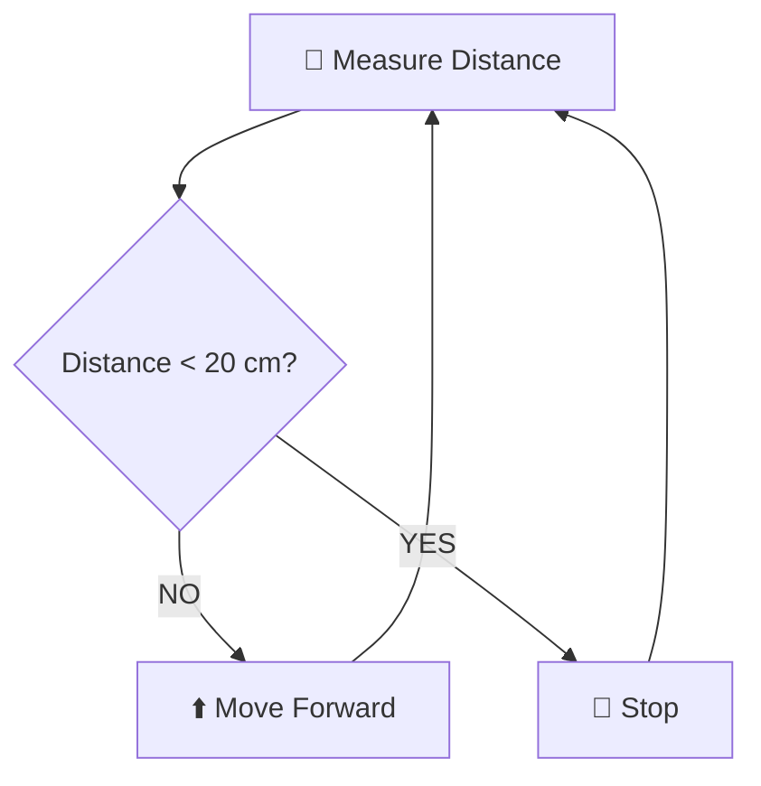
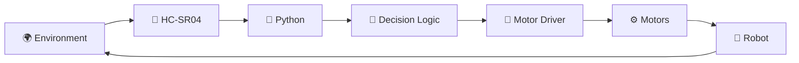
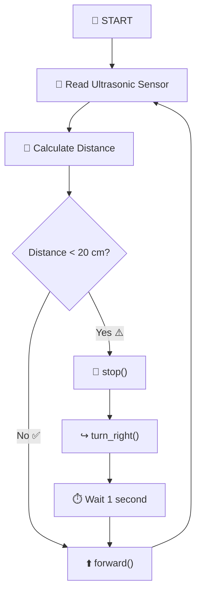
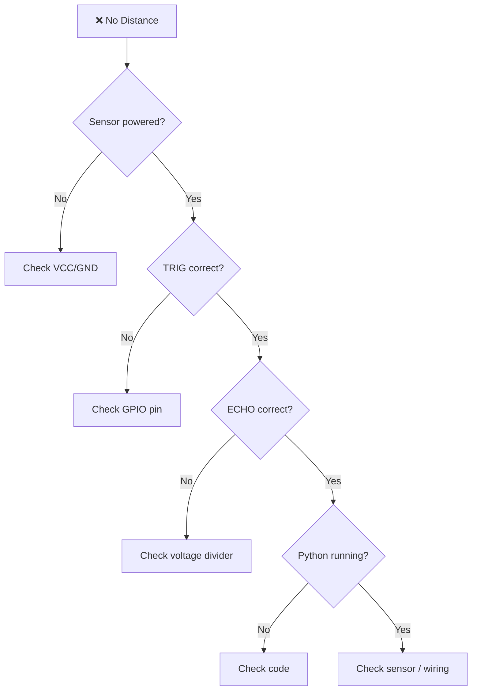
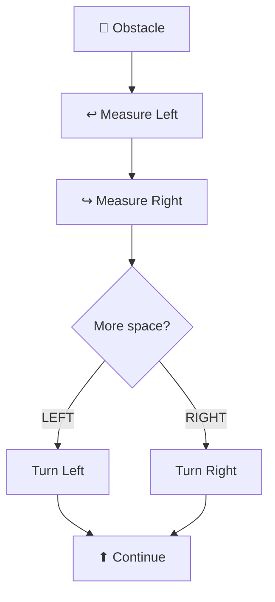
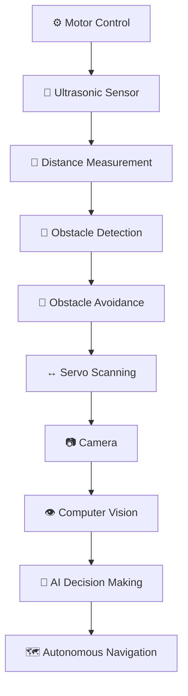
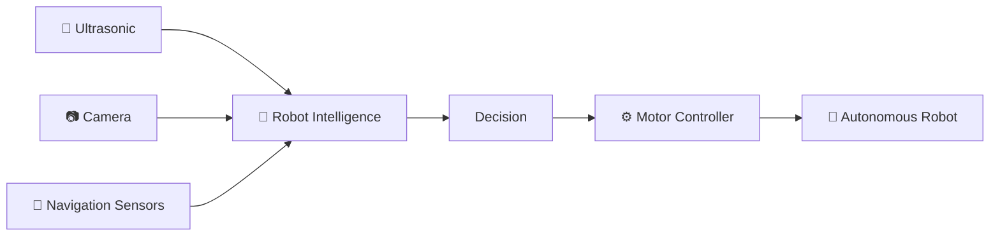

# 📡 Distance Sensing & Obstacle Avoidance
## Ultrasonic Sensor • HC-SR04 • Raspberry Pi • Python • Autonomous Robot


---

> ## 🎯 Tema
>
> I denne lektion lærer vi, hvordan en robot kan **måle afstand til objekter**, opdage forhindringer og automatisk ændre sin bevægelse.
>
> Vi kombinerer:
>
> **HC-SR04 → Raspberry Pi → Python → Motor Control → Obstacle Avoidance**

---

# 📚 Indhold

1. 📡 Introduktion til ultralydssensorer
2. 🔊 Hvordan virker ultralyd?
3. 🧩 HC-SR04 sensor
4. 🔌 HC-SR04 pinout
5. ⚡ Tilslutning til Raspberry Pi
6. ⚠️ Beskyttelse af Raspberry Pi GPIO
7. 🧮 Beregning af afstand
8. 🐍 Python-afstandsmåling
9. 🔄 Sensorens programflow
10. 🤖 Integration med motorer
11. 🚧 Obstacle Avoidance
12. 🧠 Sense → Decide → Act
13. 🧪 Lab-øvelse
14. 🎥 Live test-session
15. 🛠️ Debugging
16. ⭐ Ekstra challenges
17. 🎯 Læringsmål
18. 🚀 Næste skridt

---

# 📡 1. Introduktion til ultralydssensorer

En **ultralydssensor** bruges til at måle afstanden mellem robotten og et objekt.

Sensoren fungerer uden fysisk kontakt.

Den sender en højfrekvent lydbølge ud i omgivelserne og venter på, at lyden bliver reflekteret tilbage.

```text
        📡 SENSOR

            ))))))))))))))))))))

                            █████████
                            █ OBJECT█
                            █████████
```

Når lydbølgen rammer objektet, bliver den reflekteret tilbage.

```text
        📡 SENSOR
             │
             │ Ultrasonic pulse
             ├────────────────────────►
             │                         █████
             │                         OBJECT
             │◄────────────────────────
             │      Echo
```

Sensoren måler tiden mellem:

```text
Sound transmitted
       ↓
Object reached
       ↓
Sound reflected
       ↓
Echo received
```

Denne tid bruges til at beregne afstanden.

---

# 🔊 2. Hvad er ultralyd?

Mennesker kan normalt høre lyd op til cirka:

```text
20 kHz
```

Ultralyd er lyd med en frekvens højere end menneskets normale høreområde.

HC-SR04 arbejder omkring:

```text
40 kHz
```

Det betyder, at vi ikke kan høre signalet.

---

## 🌊 Grundprincip



---

# 🤖 Hvorfor er afstandsmåling vigtig?

En mobil robot skal kunne forstå:

```text
Er der noget foran mig?
```

Hvis robotten ikke har sensorer, kan den kun følge faste kommandoer.

For eksempel:

```text
Forward
Forward
Forward
Forward
```

Robotten ved ikke, om der står:

```text
🧱 WALL
```

foran den.

---

## Uden sensor

```text
🤖 ───────────────────────► 🧱

           CRASH!
```

---

## Med sensor

```text
🤖 ─────────────► 📡 ─────► 🧱

          distance = 18 cm

                  ↓

                STOP

                  ↓

             TURN RIGHT
```

---

# 🧩 3. HC-SR04 Ultrasonic Sensor

En meget almindelig sensor til Raspberry Pi og robotprojekter er:

# HC-SR04

En forenklet illustration:

```text
          HC-SR04

     ┌─────────────────────┐
     │                     │
     │      ◉       ◉      │
     │                     │
     │   TX          RX    │
     │                     │
     └──┬────┬────┬────┬──┘
        │    │    │    │
       VCC TRIG ECHO GND
```

De to store runde komponenter fungerer som:

```text
◉ Transmitter

◉ Receiver
```

---

# 🧠 Sensorens funktion

```text
TRIG
 │
 │ Trigger Signal
 ▼
Sensor sends ultrasonic pulse
 │
 ▼
Sound travels toward object
 │
 ▼
Object reflects sound
 │
 ▼
ECHO becomes HIGH
 │
 ▼
Python measures pulse duration
 │
 ▼
Distance calculated
```

---

# 🔌 4. HC-SR04 Pinout

HC-SR04 har fire forbindelser.

| Pin | Funktion |
|---|---|
| `VCC` | Sensorens strømforsyning |
| `TRIG` | Starter en afstandsmåling |
| `ECHO` | Returnerer pulslængden |
| `GND` | Ground |

---

## 🎨 Visuel pinout

```text
             HC-SR04
      ┌──────────────────┐
      │    ◉        ◉    │
      │                  │
      └─┬─────┬─────┬───┘
        │     │     │
      VCC   TRIG   ECHO   GND
       │      │      │     │
       │      │      │     │
      +5V   GPIO   GPIO   GND
```

---

# 🟢 VCC

`VCC` giver strøm til sensoren.

Typisk:

```text
VCC → Raspberry Pi 5V
```

---

# 🟡 TRIG

`TRIG` betyder:

## Trigger

Python sender en meget kort elektrisk puls til denne pin.

```text
GPIO
 │
 │ HIGH for approximately 10 µs
 ▼
TRIG
```

Dette fortæller HC-SR04:

```text
Start measurement!
```

---

# 🔵 ECHO

`ECHO` returnerer et signal, hvis længde repræsenterer lydens rejsetid.

```text
ECHO HIGH
│<----------------------->│

        Pulse Time
```

Jo længere objektet er væk:

```text
Longer echo pulse
```

Jo tættere objektet er:

```text
Shorter echo pulse
```

---

# ⚫ GND

Ground bruges som fælles elektrisk reference.

```text
HC-SR04 GND
     │
     ▼
Raspberry Pi GND
```

---

# 🔌 5. HC-SR04 → Raspberry Pi

I dine sensorprogrammer kan vi eksempelvis bruge:

```text
TRIG = BOARD pin 7
ECHO = BOARD pin 13
```

Det svarer til:

| Funktion | Physical BOARD | BCM GPIO |
|---|---:|---:|
| TRIG | Pin 7 | GPIO4 |
| ECHO | Pin 13 | GPIO27 |

---

# 🎨 Wiring Diagram

```text
                  RASPBERRY PI
              ┌───────────────────┐
              │                   │
      5V ─────┤                   │
              │                   │
 GPIO4/Pin7 ──┤                   │
              │                   │
GPIO27/Pin13 ─┤                   │
              │                   │
     GND ─────┤                   │
              └───────────────────┘
          │        │        │
          │        │        │
          ▼        ▼        ▼

       ┌────────────────────────┐
       │        HC-SR04         │
       │                        │
       │      ◉          ◉      │
       │                        │
       └─┬─────┬─────┬─────┬──┘
         │     │     │     │
        VCC   TRIG  ECHO   GND
```

---

# ⚠️ 6. Vigtigt — ECHO Voltage Protection

Dette er meget vigtigt.

HC-SR04 kan sende cirka:

```text
5V
```

på ECHO-signalet.

Raspberry Pi GPIO arbejder med:

```text
3.3V
```

Derfor bør en standard HC-SR04 **ikke forbindes direkte** fra ECHO til Raspberry Pi GPIO.

---

# 🛡️ Voltage Divider

En almindelig løsning er en spændingsdeler.

```text
HC-SR04 ECHO
      │
      │
     1 kΩ
      │
      ├──────────────► Raspberry Pi GPIO27
      │
     2 kΩ
      │
      ▼
     GND
```

Spændingen bliver omtrent:

```text
                 2 kΩ
5V × ─────────────────────────
            1 kΩ + 2 kΩ

≈ 3.3V
```

---

> ## ⚠️ Hardware Safety
>
> Tilslut ikke et 5V ECHO-signal direkte til en Raspberry Pi GPIO-pin.
>
> Brug en passende **voltage divider eller level shifter**.

---

# 🧮 7. Hvordan beregnes afstanden?

Sensoren måler den tid, som lyden bruger på at:

```text
Sensor → Object → Sensor
```

Lydens hastighed i luft er omtrent:

```text
343 m/s
```

eller:

```text
34,300 cm/s
```

---

# 📐 Formula

```text
Distance =
Time × Speed of Sound
─────────────────────
          2
```

Vi dividerer med `2`, fordi lyden rejser:

```text
Sensor → Object
```

og derefter:

```text
Object → Sensor
```

---

## Eksempel

Hvis echo-tiden er:

```text
0.002 seconds
```

så:

```text
distance = (0.002 × 34300) / 2
```

Resultat:

```text
≈ 34.3 cm
```

---

# 🧠 Visuel afstandsberegning



---

# 🐍 8. Python-afstandsmåling

Først importerer vi bibliotekerne.

```python
import RPi.GPIO as GPIO
import time
```

---

# GPIO Configuration

```python
GPIO.setwarnings(False)
GPIO.setmode(GPIO.BOARD)
```

`GPIO.BOARD` betyder, at vi bruger Raspberry Pi's **fysiske pin-numre**.

---

# Definer pins

```python
TRIG = 7
ECHO = 13
```

---

# Konfigurer pins

```python
GPIO.setup(TRIG, GPIO.OUT)
GPIO.setup(ECHO, GPIO.IN)
```

Det betyder:

```text
TRIG
  ↓
OUTPUT

ECHO
  ↓
INPUT
```

---

# 📡 Send Trigger Pulse

Sensoren skal have en meget kort puls.

```python
GPIO.output(TRIG, False)
time.sleep(0.0002)

GPIO.output(TRIG, True)
time.sleep(0.00001)

GPIO.output(TRIG, False)
```

---

## Visualisering

```text
TRIG SIGNAL

LOW ─────────┐
             │
             └── HIGH ──┐
                         │
                         └──────── LOW

                10 µs
```

---

# ⏱️ Measure ECHO

Vi registrerer, hvornår ECHO begynder.

```python
while GPIO.input(ECHO) == 0:
    pulse_start = time.perf_counter()
```

Derefter registrerer vi, hvornår ECHO slutter.

```python
while GPIO.input(ECHO) == 1:
    pulse_end = time.perf_counter()
```

---

# Beregn pulslængde

```python
pulse_duration = pulse_end - pulse_start
```

---

# Beregn afstand

```python
distance = (pulse_duration * 34300) / 2
```

---

# 📏 Complete Example

```python
import RPi.GPIO as GPIO
import time


GPIO.setwarnings(False)
GPIO.setmode(GPIO.BOARD)


TRIG = 7
ECHO = 13


GPIO.setup(TRIG, GPIO.OUT)
GPIO.setup(ECHO, GPIO.IN)


def measure_distance():

    GPIO.output(TRIG, False)
    time.sleep(0.0002)

    GPIO.output(TRIG, True)
    time.sleep(0.00001)
    GPIO.output(TRIG, False)

    start_time = time.perf_counter()
    stop_time = time.perf_counter()

    timeout = time.perf_counter() + 0.02

    while GPIO.input(ECHO) == 0:

        start_time = time.perf_counter()

        if start_time > timeout:
            return None

    timeout = time.perf_counter() + 0.02

    while GPIO.input(ECHO) == 1:

        stop_time = time.perf_counter()

        if stop_time > timeout:
            return None

    time_elapsed = stop_time - start_time

    distance = (time_elapsed * 34300) / 2

    return distance
```

---

# 🔄 9. Main Sensor Loop

Nu kan vi måle afstanden kontinuerligt.

```python
try:

    while True:

        distance = measure_distance()

        if distance is None:

            print("No object detected")

        else:

            print(
                f"Distance: {distance:.1f} cm"
            )

        time.sleep(1)


except KeyboardInterrupt:

    print("Program stopped")

    GPIO.cleanup()
```

---

# 🖥️ Eksempel på output

```text
Distance: 86.7 cm

Distance: 72.4 cm

Distance: 53.1 cm

Distance: 31.6 cm

Distance: 19.2 cm

Distance: 12.7 cm
```

Robotten kan nu:

# 📡 SENSE

men den træffer endnu ikke nogen beslutning.

---

# 🧠 10. Fra afstandsmåling til beslutning

Nu tilføjer vi en regel.

Eksempel:

```text
Safe Distance = 20 cm
```

---

## Decision

```text
IF distance >= 20 cm

    FORWARD

ELSE

    STOP
```

---

## Visuel beslutning



Dette er begyndelsen på **autonom beslutningstagning**.

---

# 🤖 11. Integration med motorer

Nu kombinerer vi:

```text
ULTRASONIC SENSOR
        +
MOTOR CONTROL
```

---

## System Architecture



---

# 🚗 Robot Movement Functions

Vi antager, at motorprogrammet indeholder:

```python
forward()
backward()
turn_left()
turn_right()
stop()
```

---

# 🟢 Clear Path

Hvis:

```text
Distance = 70 cm
```

så:

```text
70 >= 20
```

og robotten kører:

```text
⬆️ FORWARD
```

---

# 🔴 Obstacle Detected

Hvis:

```text
Distance = 15 cm
```

så:

```text
15 < 20
```

robotten skal reagere.

```text
🛑 STOP
    │
    ▼
↪ TURN RIGHT
    │
    ▼
⬆ FORWARD
```

---

# 🚧 12. Basic Obstacle Avoidance

En simpel strategi kan være:

```text
Move Forward
     │
     ▼
Measure Distance
     │
     ▼
Obstacle?
   /     \
 No      Yes
 │        │
 ▼        ▼
Forward  Stop
          │
          ▼
       Turn Right
          │
          ▼
       Forward
```

---

# 🌈 Complete Flowchart



---

# 🧠 13. Sense → Decide → Act

Dette er en meget vigtig model inden for robotteknologi.

```text
            ┌───────────────────────┐
            │                       │
            ▼                       │
        📡 SENSE                    │
            │                       │
            ▼                       │
        🧠 DECIDE                   │
            │                       │
            ▼                       │
         ⚙️ ACT                    │
            │                       │
            ▼                       │
      🌍 ENVIRONMENT ──────────────┘
```

---

# 📡 Sense

Robotten bruger HC-SR04.

```text
Sensor
  ↓
Distance
```

---

# 🧠 Decide

Python beslutter:

```python
if distance >= 20:
    forward()
else:
    stop()
```

---

# ⚙️ Act

Motorerne ændrer robotens bevægelse.

```text
Decision
   │
   ▼
Motor Driver
   │
   ▼
Motors
   │
   ▼
Robot Movement
```

---

# 🤖 Feedback Loop

Denne proces stopper ikke efter én måling.

Robotten gentager:

```text
Sense
 ↓
Decide
 ↓
Act
 ↓
Sense
 ↓
Decide
 ↓
Act
 ↓
...
```

Dette kaldes en:

# Feedback Loop

---

# 🐍 14. Combined Python Logic

Her er den grundlæggende struktur:

```python
while True:

    distance = measure_distance()

    if distance is None:

        stop()

    elif distance >= 20:

        forward()

    else:

        stop()

        time.sleep(0.3)

        turn_right()

        time.sleep(1)

        stop()

        time.sleep(0.2)
```

---

> ## 💡 Bemærk
>
> Motorfunktionerne skal forbindes til den motorstyring, I allerede har udviklet i de tidligere robotøvelser.

---

# 🧪 15. LAB — Distance Sensing

## 🎯 Lab 1: Measure Distance

### Opgave

Lav et Python-program, der kontinuerligt måler afstanden foran robotten.

---

## Krav

Programmet skal vise eksempelvis:

```text
Distance: 81.2 cm
Distance: 61.7 cm
Distance: 44.6 cm
Distance: 29.4 cm
Distance: 17.8 cm
```

---

## Test

Hold forskellige objekter foran sensoren.

Prøv:

| Test | Distance |
|---|---:|
| Object A | 100 cm |
| Object B | 50 cm |
| Object C | 30 cm |
| Object D | 20 cm |
| Object E | 10 cm |

---

# 🧪 16. LAB — Distance Zones

Udvid programmet med tre afstandszoner.

---

## 🟢 Safe Zone

```text
Distance > 50 cm
```

Output:

```text
CLEAR
```

---

## 🟡 Warning Zone

```text
20 cm – 50 cm
```

Output:

```text
WARNING
```

---

## 🔴 Danger Zone

```text
Distance < 20 cm
```

Output:

```text
OBSTACLE!
```

---

# 🎨 Distance Zone Visualization

```text
0 cm           20 cm                 50 cm
│───────────────│──────────────────────│────────────►

      🔴                🟡                   🟢

    DANGER            WARNING               CLEAR

    STOP              CAUTION              FORWARD
```

---

# 🐍 Eksempel på beslutningslogik

```python
if distance < 20:

    print("🔴 OBSTACLE")

elif distance < 50:

    print("🟡 WARNING")

else:

    print("🟢 CLEAR")
```

---

# 🧪 17. LAB — Basic Obstacle Avoidance Robot

## 🎯 Objective

Udvikl en robot, der:

1. kører fremad,
2. måler afstanden,
3. opdager forhindringer,
4. stopper,
5. drejer til højre,
6. fortsætter fremad.

---

# 🚦 Expected Behavior

```text
                START
                  │
                  ▼
              FORWARD
                  │
                  ▼
          MEASURE DISTANCE
                  │
                  ▼
         Distance < 20 cm?
              /         \
            NO           YES
            │             │
            ▼             ▼
         FORWARD         STOP
                           │
                           ▼
                     TURN RIGHT
                           │
                           ▼
                      1 SECOND
                           │
                           ▼
                       FORWARD
```

---

# 🎯 Lab Requirements

Robotten skal:

- [ ] Måle afstand kontinuerligt.
- [ ] Vise afstanden i centimeter.
- [ ] Køre frem, når vejen er fri.
- [ ] Stoppe ved mindre end 20 cm.
- [ ] Dreje til højre.
- [ ] Fortsætte fremad.
- [ ] Gentage processen automatisk.
- [ ] Stoppe sikkert med `Ctrl + C`.

---

# 📊 Grading Rubric

| Kriterium | Point |
|---|---:|
| 📡 Sensor measurement | 2 |
| 📏 Correct distance calculation | 2 |
| 🧠 Decision logic | 2 |
| ⚙️ Motor integration | 2 |
| 🛑 Safe obstacle response | 1 |
| 📝 Code structure/comments | 1 |
| **TOTAL** | **10** |

---

# 🎥 18. Live Test Session

Den bedste måde at undervise dette emne på er at bygge systemet trin for trin.

---

# 🎥 Demo 1 — Sensor Only

Kør kun ultralydssensoren.

```text
📡 HC-SR04
     │
     ▼
🐍 Python
     │
     ▼
🖥️ Terminal
```

Output:

```text
Distance: 74.2 cm
Distance: 53.1 cm
Distance: 31.0 cm
Distance: 18.7 cm
```

---

## Classroom Test

Bed en studerende om langsomt at flytte en bog mod sensoren.

```text
📡                                  📘

90 cm
```

Flyt tættere:

```text
📡                      📘

60 cm
```

Endnu tættere:

```text
📡             📘

30 cm
```

Til sidst:

```text
📡      📘

10 cm
```

De studerende skal kunne se værdierne ændre sig i terminalen.

---

# 🎥 Demo 2 — Motor Only

Test motorfunktionerne uden sensor.

```python
forward()
```

derefter:

```python
stop()
```

derefter:

```python
turn_right()
```

---

## Testsekvens

```text
⬆ Forward

🛑 Stop

↪ Right

🛑 Stop
```

---

# 🎥 Demo 3 — Sensor + Motor

Nu kombineres begge systemer.

```text
📡 SENSOR
    │
    ▼
DISTANCE
    │
    ▼
🐍 PYTHON
    │
    ▼
DECISION
    │
    ▼
⚙️ MOTOR
    │
    ▼
🤖 ROBOT
```

---

# 🎥 Demo 4 — Real Obstacle

Placer en kasse foran robotten.

```text
🤖 ───────────────────► 📦
```

Robotten kører frem.

```text
Distance: 70 cm

⬆ FORWARD
```

---

Derefter:

```text
Distance: 45 cm

⬆ FORWARD
```

---

Derefter:

```text
Distance: 22 cm

⬆ FORWARD
```

---

Til sidst:

```text
Distance: 18 cm

⚠️ OBSTACLE!
```

Robotten udfører:

```text
🛑 STOP
   │
   ▼
↪ RIGHT
   │
   ▼
⬆ FORWARD
```

---

# 🛠️ 19. Debugging

Hvis sensoren ikke virker, skal vi teste trin for trin.



---

# ❗ Problem: Distance Always Zero

Kontroller:

```text
TRIG wiring
ECHO wiring
GPIO numbering
Ground
```

---

# ❗ Problem: Very Large Values

Mulige årsager:

- ingen refleksion,
- objektet står skævt,
- timeout mangler,
- dårlig ledningsforbindelse.

---

# ❗ Problem: Random Measurements

Ultralyd kan påvirkes af:

- bløde materialer,
- vinkler,
- støj,
- refleksioner,
- bevægelige objekter.

---

# 🧠 20. Hvorfor bruger vi timeout?

Uden timeout kan følgende løkke potentielt vente meget længe:

```python
while GPIO.input(ECHO) == 0:
```

Hvis sensoren aldrig modtager et echo, kan programmet blive hængende.

Derfor bruger vi:

```text
TIMEOUT
```

---

## Visualisering

```text
Wait for ECHO
     │
     ▼
Echo received?
   /      \
 YES      NO
 │         │
 ▼         ▼
Measure   Timeout
          │
          ▼
       return None
```

---

# ⭐ 21. Challenge 1 — Adjustable Safety Distance

Lav en variabel:

```python
SAFE_DISTANCE = 20
```

Brug:

```python
if distance < SAFE_DISTANCE:
```

Prøv derefter:

```text
10 cm
20 cm
30 cm
40 cm
```

Diskuter hvordan robotens adfærd ændrer sig.

---

# ⭐⭐ 22. Challenge 2 — Warning Zone

Tilføj en advarselszone.

```text
Distance > 50 cm

🟢 CLEAR
```

```text
20–50 cm

🟡 WARNING
```

```text
< 20 cm

🔴 OBSTACLE
```

---

# ⭐⭐⭐ 23. Challenge 3 — Left or Right?

I stedet for altid at dreje til højre:

```text
Obstacle Detected
       │
       ▼
Choose Direction
     /      \
    ▼        ▼
 LEFT      RIGHT
```

---

# ⭐⭐⭐⭐ 24. Challenge 4 — Servo Scanner

Monter HC-SR04 på en servo.

```text
                 📡
              HC-SR04
                 │
               SERVO
             /    |    \
            /     |     \
           ▼      ▼      ▼

        LEFT    FRONT   RIGHT
```

Robotten kan derefter måle:

```text
Left Distance

Front Distance

Right Distance
```

---

# 🧠 Smarter Decision



---

# ⭐⭐⭐⭐⭐ 25. Challenge 5 — Smarter Navigation

Nu kan robotten vælge den bedste vej.

Eksempel:

```text
Left   = 25 cm
Front  = 12 cm
Right  = 78 cm
```

Beslutning:

```text
RIGHT has most space

         ↓

     TURN RIGHT
```

---

# 🤖 26. Fra Reactive Robot til Autonomous Robot

Det første obstacle avoidance-system er **reaktivt**.

```text
Obstacle
   │
   ▼
Reaction
```

Robotten reagerer kun på den aktuelle sensorværdi.

---

Senere kan vi introducere:

```text
Sensors
   ↓
Memory
   ↓
Environment Model
   ↓
Planning
   ↓
Decision
   ↓
Movement
```

---

# 🚀 27. Udviklingsvej



---

# 🎯 28. Learning Outcomes

Efter lektionen skal den studerende kunne:

## 📡 Sensor

- ✅ Forklare hvad en ultralydssensor er.
- ✅ Forklare hvordan HC-SR04 fungerer.
- ✅ Identificere VCC, TRIG, ECHO og GND.
- ✅ Forklare hvorfor ECHO kræver spændingsbeskyttelse.
- ✅ Måle afstand.

---

## 🐍 Python

- ✅ Konfigurere GPIO.
- ✅ Sende et trigger-signal.
- ✅ Måle en ECHO-puls.
- ✅ Arbejde med `time.perf_counter()`.
- ✅ Beregne afstand.
- ✅ Bruge `if / elif / else`.
- ✅ Bruge `while True`.
- ✅ Implementere timeout.
- ✅ Håndtere `KeyboardInterrupt`.

---

## 🤖 Robotics

- ✅ Kombinere sensorer og motorer.
- ✅ Implementere obstacle detection.
- ✅ Implementere obstacle avoidance.
- ✅ Forstå feedback loops.
- ✅ Implementere Sense → Decide → Act.
- ✅ Teste en robot systematisk.

---

# 🧠 29. Huskeregel

```text
             🌍 ENVIRONMENT
                    │
                    ▼
               📡 SENSOR
                    │
                    ▼
               📏 DISTANCE
                    │
                    ▼
               🐍 PYTHON
                    │
                    ▼
               🧠 DECISION
                    │
                    ▼
               ⚙️ MOTORS
                    │
                    ▼
                🤖 ROBOT
                    │
                    └─────────────► Environment
```

---

# 🌟 30. Opsummering

Vi begyndte med:

```text
📡 Ultrasonic Sensor
```

og lærte derefter:

```text
📡 HC-SR04
      │
      ▼
🔌 GPIO
      │
      ▼
⏱️ Echo Timing
      │
      ▼
📏 Distance
      │
      ▼
🧠 Decision
      │
      ▼
⚙️ Motor Control
      │
      ▼
🚧 Obstacle Avoidance
```

---

# 🏁 Fra sensor til autonom adfærd

Når robotten selv kan:

```text
SENSE
  ↓
DECIDE
  ↓
ACT
```

har vi taget et vigtigt skridt væk fra en robot, som kun følger programmerede bevægelser.

Vi bevæger os i stedet mod en robot, der kan:

```text
Observe Environment
        ↓
Understand Situation
        ↓
Make Decision
        ↓
Change Movement
```

---

# 🚀 Næste lektion

En naturlig fortsættelse er:

## 🧭 Advanced Obstacle Avoidance & Autonomous Navigation

hvor vi kan arbejde med:

- flere sensorer,
- servo-baseret scanning,
- afstand til venstre/højre,
- PWM speed control,
- smartere turning,
- kamera,
- OpenCV,
- object detection,
- AI-baseret beslutningstagning.

---

# 🔮 Future Architecture



---

# 📂 Python Sensor Examples

```md
[ultrasonic_sensor_v1.py](https://github.com/zk222ac001/Autonom_med_Python_og_AI/blob/main/ultrasonic_sensor._v1.py)

[ultrasonic_sensor_v2.py](https://github.com/zk222ac001/Autonom_med_Python_og_AI/blob/main/ultrasonic_sensor_v2.py)

[ultrasonic_sensor_v3.py](https://github.com/zk222ac001/Autonom_med_Python_og_AI/blob/main/ultrasonic_sensor_v3.py)
```

---

# 📚 Technologies

`Python` • `Raspberry Pi` • `GPIO` • `HC-SR04` • `Ultrasonic Sensor` • `Distance Measurement` • `Motor Control` • `Obstacle Detection` • `Obstacle Avoidance` • `Autonomous Robotics`

---

> # 💡 Final Thought
>
> **A robot becomes more intelligent when it stops following only fixed commands and starts changing its behavior based on what it senses.**

---

# 🤖 Autonomous Robot with Python and AI

### 📡 Sense → 🧠 Decide → ⚙️ Act → 🔄 Repeat

**Build • Test • Observe • Improve • Automate**