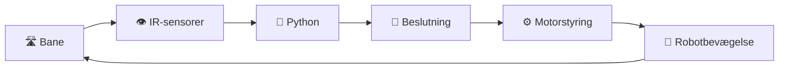
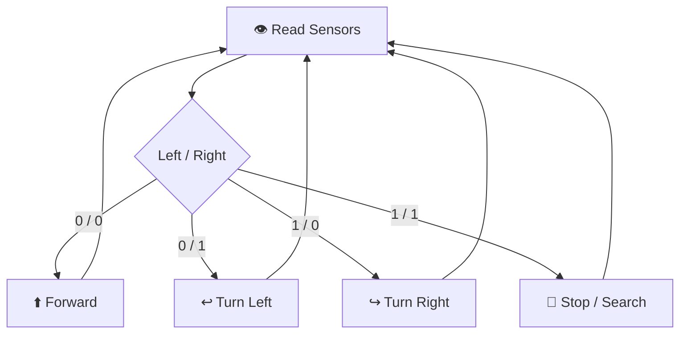
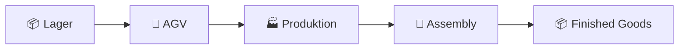
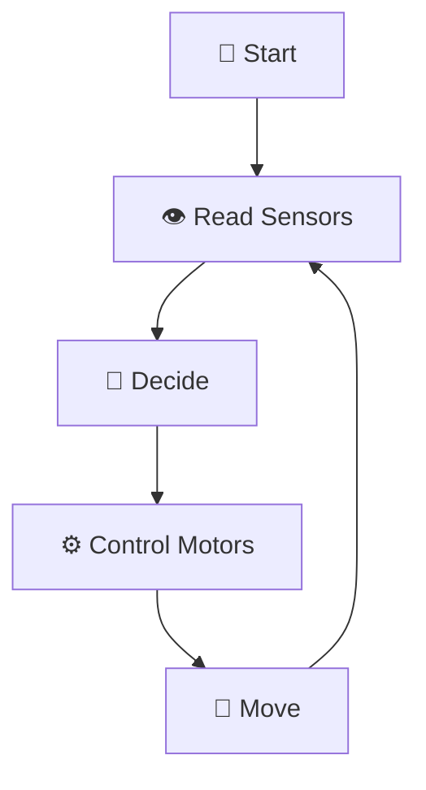
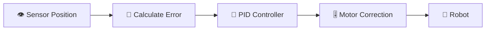
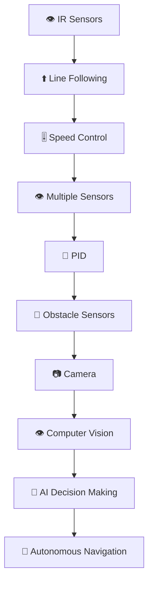

# 🤖 Line Following Robot – Komplet GitHub-undervisningspakke
## Raspberry Pi • Python • IR-sensorer • Motorstyring • Autonom Navigation


---

# 🎯 Læringsmål

Efter dette forløb skal den studerende kunne:

- forklare, hvad en **line-following robot** er
- forklare, hvordan en **IR-reflektionssensor** fungerer
- skelne mellem **reflekterende og ikke-reflekterende overflader**
- forklare forskellen mellem **analogt og digitalt sensoroutput**
- tilslutte to IR-sensorer til en Raspberry Pi
- læse digitale sensorværdier med Python
- bruge `if`, `elif`, `else` og `while True`
- koble sensorinput til motorretning
- implementere en simpel **feedback loop**
- forklare brugen af line following i industrien
- teste, fejlfinde og forbedre robotadfærd

---

# 📘 1. Introduktion til Line Following

En **line-following robot** er en autonom robot, som følger en markeret linje på gulvet ved hjælp af sensorer.

En typisk bane består af:

- ⚫ sort tape
- ⚪ lys eller hvid baggrund

```text
             ROBOT
        ┌─────────────┐
        │     🤖      │
        └─────────────┘
            👁   👁
             \ /
              █
              █
              █
          BLACK LINE
```

Robotten arbejder efter:

```text
SENSE
  ↓
DECIDE
  ↓
ACT
  ↓
REPEAT
```



---

# 👁️ 2. Hvordan IR-sensorer virker

**IR** betyder **Infrared**.

En IR-reflektionssensor sender infrarødt lys ned mod en overflade og måler, hvor meget lys der reflekteres tilbage.

```text
        IR SENSOR
           │
           │ IR light
           ▼
        Surface
           │
           │ reflected light
           ▼
        IR SENSOR
```

## ⚪ Hvid overflade

En lys overflade reflekterer typisk meget IR-lys.

```text
        SENSOR
          ↓
       ↓↓↓↓↓↓↓
══════════════════════
       WHITE
══════════════════════
       ↑↑↑↑↑↑↑
   strong reflection
```

## ⚫ Sort tape

Sort tape absorberer mere IR-lys.

```text
        SENSOR
          ↓
       ↓↓↓↓↓↓↓
██████████████████████
     BLACK TAPE
██████████████████████
          ↑
    weak reflection
```

---

# 📊 3. Analogt og Digitalt Output

## Digitalt output

Digitalt output giver normalt kun:

```text
0
eller
1
```

Eksempel:

```text
0 = sort registreret
1 = hvid registreret
```

> ⚠️ Nogle sensorer bruger omvendt logik. Test altid sensoren først.

## Analogt output

Analogt output giver en kontinuerlig måleværdi, fx:

```text
0
100
250
510
780
1023
```

| Type | Output | Fordel | Ulempe |
|---|---|---|---|
| Digital | 0 / 1 | Let at programmere | Mindre præcision |
| Analog | Kontinuerlig værdi | Mere præcision | Mere kompleks |

---

# 🔌 4. Wiring IR Sensors

Eksempel:

| Sensor | Raspberry Pi |
|---|---|
| Left IR OUT | GPIO17 |
| Right IR OUT | GPIO27 |
| VCC | 3.3V / 5V afhængigt af modulet |
| GND | GND |

```text
        ┌─────────────────────────┐
        │      Raspberry Pi       │
        │ GPIO17 ◄── LEFT IR OUT  │
        │ GPIO27 ◄─ RIGHT IR OUT  │
        │ Power ───────► VCC      │
        │ GND ─────────► GND      │
        └─────────────────────────┘
```

> ⚠️ Kontrollér altid sensorens datablad og spændingsniveau.

---

# 👁️👁️ 5. To-sensor Setup

```text
                 FRONT
                   ↑

          ┌────────────────┐
          │      ROBOT     │
          │       🤖       │
          └────────────────┘

             👁         👁
           LEFT       RIGHT

                ███
                ███
                ███
             BLACK LINE
```

Med to sensorer kan robotten afgøre:

- om den er centreret
- om den skal korrigere til venstre
- om den skal korrigere til højre
- om linjen er mistet

---

# 🧠 6. Grundlæggende Line-Following Logik

Antag:

```text
0 = BLACK
1 = WHITE
```

| Left | Right | Situation | Handling |
|---:|---:|---|---|
| 0 | 0 | Begge ser sort | ⬆️ Forward |
| 0 | 1 | Højre ser hvid | ↩️ Turn Left |
| 1 | 0 | Venstre ser hvid | ↪️ Turn Right |
| 1 | 1 | Begge ser hvid | 🛑 Stop / Search |



---

# 🐍 7. Python-kode

## Sensor Setup

```python
import RPi.GPIO as GPIO
import time

GPIO.setwarnings(False)
GPIO.setmode(GPIO.BCM)

LEFT_SENSOR = 17
RIGHT_SENSOR = 27

GPIO.setup(LEFT_SENSOR, GPIO.IN)
GPIO.setup(RIGHT_SENSOR, GPIO.IN)
```

## Sensortest

```python
try:
    while True:
        left = GPIO.input(LEFT_SENSOR)
        right = GPIO.input(RIGHT_SENSOR)

        print(f"Left={left} Right={right}")
        time.sleep(0.2)

except KeyboardInterrupt:
    GPIO.cleanup()
```

## Movement Functions

```python
def forward():
    print("FORWARD")

def turn_left():
    print("TURN LEFT")

def turn_right():
    print("TURN RIGHT")

def stop():
    print("STOP")
```

## Basic Line-Following Program

```python
import RPi.GPIO as GPIO
import time

GPIO.setwarnings(False)
GPIO.setmode(GPIO.BCM)

LEFT_SENSOR = 17
RIGHT_SENSOR = 27

GPIO.setup(LEFT_SENSOR, GPIO.IN)
GPIO.setup(RIGHT_SENSOR, GPIO.IN)

def forward():
    print("FORWARD")

def turn_left():
    print("TURN LEFT")

def turn_right():
    print("TURN RIGHT")

def stop():
    print("STOP")

try:
    while True:
        left = GPIO.input(LEFT_SENSOR)
        right = GPIO.input(RIGHT_SENSOR)

        print(f"Left={left} Right={right}")

        if left == 0 and right == 0:
            forward()

        elif left == 0 and right == 1:
            turn_left()

        elif left == 1 and right == 0:
            turn_right()

        else:
            stop()

        time.sleep(0.05)

except KeyboardInterrupt:
    print("Program stopped")

finally:
    stop()
    GPIO.cleanup()
```

---

# 🏭 8. Industrielle anvendelser

Line-following-princippet bruges bl.a. i:

- 📦 Warehouse robots
- 🚚 AGV – Automated Guided Vehicles
- 🏥 Hospital transport
- 🏭 Produktionslinjer
- 📦 Material handling



---

# 👨‍🏫 9. Undervisningsaktiviteter

## Aktivitet 1 – Human Sensor

Roller:

- 👁 Student 1 = Left Sensor
- 👁 Student 2 = Right Sensor
- 🧠 Student 3 = Python
- 🤖 Student 4 = Robot

Sensor-studerende siger `0` eller `1`.

Python-studerende vælger:

```text
FORWARD
LEFT
RIGHT
STOP
```

---

## Aktivitet 2 – Materialetest

| Materiale | Sensorværdi |
|---|---|
| Sort tape | |
| Hvidt papir | |
| Mørkt papir | |
| Træ | |
| Blank plast | |

Diskutér:

- Hvilken overflade reflekterer mest?
- Hvordan påvirker sensorhøjden målingen?
- Hvilke materialer giver ustabile værdier?

---

## Aktivitet 3 – Sensor Calibration

Test sensoren i forskellige højder:

```text
1 cm
2 cm
3 cm
4 cm
5 cm
```

Find den højde, der giver mest stabile værdier.

---

## Aktivitet 4 – Decision Table Game

Underviseren viser:

```text
Left = 0
Right = 1
```

Studerende skal svare:

```text
TURN LEFT
```

Gentag med alle kombinationer.

---

## Aktivitet 5 – Debugging Challenge

Find fejlen:

```python
elif left == 1 and right == 0:
    turn_left()
```

Forklar, hvorfor robotten vil reagere forkert.

---

# 🧪 10. Laboratorieopgave

## LAB – IR Sensor Line Detection

### Formål

Byg og test et system, der:

1. aflæser to IR-sensorer
2. identificerer sort/hvid
3. afgør robotretning
4. viser beslutningen i terminalen

### Del 1 – Sensor Test

Programmet skal kunne vise:

```text
Left=0 Right=0 → FORWARD
Left=0 Right=1 → LEFT
Left=1 Right=0 → RIGHT
Left=1 Right=1 → STOP
```

### Del 2 – Implementér funktioner

```python
forward()
turn_left()
turn_right()
stop()
```

### Del 3 – Integrér motorerne

Erstat `print()` med motor-GPIO-signaler.

### Del 4 – Test på bane

Test i rækkefølge:

```text
STRAIGHT LINE
   ↓
CURVE
   ↓
S-CURVE
   ↓
FULL TRACK
```

---

# ✅ Lab Checklist

- [ ] Begge sensorer kan læses
- [ ] Sort/hvid er kalibreret
- [ ] Forward fungerer
- [ ] Turn Left fungerer
- [ ] Turn Right fungerer
- [ ] Stop fungerer
- [ ] Robotten reagerer på sensorer
- [ ] Programmet kan stoppes sikkert

---

# 🏁 11. Mini-projekt

## 🤖 Build a Basic Line Following Robot

Robotten skal:

- bruge mindst to IR-sensorer
- følge en sort linje
- korrigere mod venstre
- korrigere mod højre
- stoppe eller søge, hvis linjen mistes
- fungere uden manuel styring



---

# 🧠 12. Quiz

## Question 1
Hvad står IR for?

A. Internal Rotation  
B. Infrared  
C. Intelligent Robot  
D. Input Reader  

## Question 2
Hvilken overflade reflekterer normalt mest IR-lys?

A. Sort tape  
B. Hvid overflade  
C. Begge ens  
D. Ingen  

## Question 3
Hvad betyder digital sensoroutput typisk?

A. Mange kontinuerlige værdier  
B. Kun tekst  
C. To logiske tilstande  
D. Motorhastighed  

## Question 4
Hvad bruges `GPIO.IN` til?

A. Styre motor  
B. Læse sensor  
C. Stoppe Python  
D. Aktivere PWM  

## Question 5
Hvis `Left = 0`, `Right = 1` og `0 = black`, hvilken handling bruger vores eksempel?

A. Forward  
B. Left  
C. Right  
D. Backward  

## Question 6
Hvorfor bruger vi `while True`?

A. For at køre programmet én gang  
B. For at gentage sensoraflæsning kontinuerligt  
C. For at importere GPIO  
D. For at slukke Raspberry Pi  

## Question 7
Hvad er en feedback loop?

A. En Python-fejl  
B. Et system uden sensor  
C. En gentaget proces med input, beslutning og handling  
D. En type motor  

## Question 8
Hvor bruges AGV'er ofte?

A. Lager og produktion  
B. Kun gaming  
C. Kun sociale medier  
D. Ingen steder  

## Question 9
Hvorfor skal sensorens 0/1-logik testes?

A. Fordi alle sensorer er ens  
B. Fordi logikken kan være omvendt  
C. Fordi Python ikke understøtter 0  
D. Fordi motorer ikke bruger GPIO  

## Question 10
Hvad kan ske, hvis robotten korrigerer for kraftigt?

A. Den kan zig-zagge  
B. Sensoren slukker permanent  
C. Raspberry Pi skifter OS  
D. Python bliver analogt  

---

# ✅ Quiz – Facit

| Spørgsmål | Svar |
|---:|---|
| 1 | B |
| 2 | B |
| 3 | C |
| 4 | B |
| 5 | B |
| 6 | B |
| 7 | C |
| 8 | A |
| 9 | B |
| 10 | A |

---

# 💭 13. Refleksionsspørgsmål

1. Hvorfor reagerer IR-sensoren forskelligt på sort og hvid?
2. Hvordan påvirker sensorens højde målingen?
3. Hvilke materialer kan skabe problemer?
4. Hvad er forskellen mellem analogt og digitalt output?
5. Hvorfor bruger vi `if / elif / else`?
6. Hvorfor læses sensorerne kontinuerligt?
7. Hvad sker der, hvis `time.sleep()` er for langt?
8. Hvorfor kan robotten begynde at zig-zagge?
9. Hvordan kan robotten gøres mere stabil?
10. Hvad bør robotten gøre, hvis begge sensorer mister linjen?
11. Hvordan kunne tre sensorer forbedre systemet?
12. Hvorfor er AGV'er nyttige i lager og produktion?
13. Hvilke begrænsninger har line-following sammenlignet med kamera-navigation?

---

# 🏆 14. Bedømmelse

| Område | Point |
|---|---:|
| 👁️ Sensorforståelse | 3 |
| 🔌 Hardware / wiring | 3 |
| 🐍 Python-kode | 4 |
| 🧠 Decision logic | 3 |
| ⚙️ Motorintegration | 3 |
| 🧪 Test og debugging | 2 |
| 💭 Refleksion | 2 |
| **TOTAL** | **20** |

---

# 📦 15. Aflevering

Studerende afleverer:

1. `line_follower.py`
2. kort hardwarebeskrivelse
3. sensor- og motorlogik
4. testresultater
5. refleksion

### Testtabel

| Test | Resultat | Kommentar |
|---|---|---|
| White surface | | |
| Black tape | | |
| Forward | | |
| Left correction | | |
| Right correction | | |
| Full track | | |

---

# 🚀 16. Videre udvikling

## ⭐ Level 1 – PWM Speed Control

```text
Left Motor  = 40%
Right Motor = 60%
```

## ⭐⭐ Level 2 – Tre sensorer

```text
LEFT      CENTER      RIGHT
 👁          👁          👁
```

## ⭐⭐⭐ Level 3 – Fem sensorer

```text
L2    L1    C    R1    R2
👁     👁    👁    👁     👁
```

## ⭐⭐⭐⭐ Level 4 – Proportional Steering

Motorhastigheder ændres gradvist i stedet for kun ON/OFF.

## ⭐⭐⭐⭐⭐ Level 5 – PID Control

```text
P = Proportional
I = Integral
D = Derivative
```



---

# 🧭 Fra Line Following til Autonomous Navigation



---

# 🌟 Opsummering

```text
Sensors
   +
Python
   +
Decision Logic
   +
Motor Control
   =
Autonomous Behavior
```

Robotten arbejder kontinuerligt med:

```text
SENSE
  ↓
DECIDE
  ↓
ACT
  ↓
REPEAT
```

---

> ## 💡 Final Thought
>
> **En robot bliver mere autonom, når dens bevægelser ikke kun kommer fra faste kommandoer, men fra data, som den selv indsamler fra omgivelserne.**

# 🤖 👁 Sense → 🧠 Decide → ⚙️ Act → 🔄 Improve
