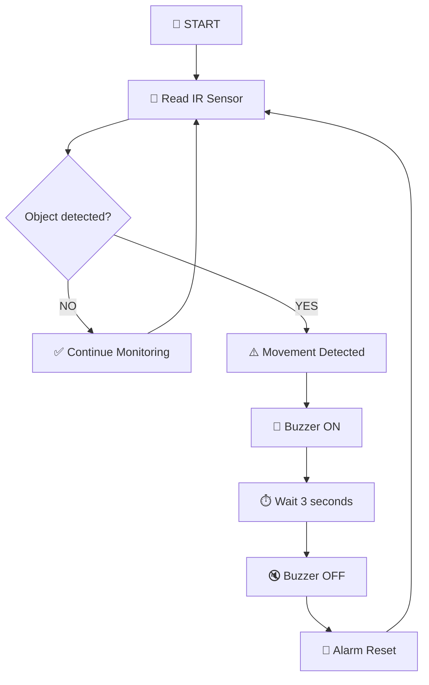
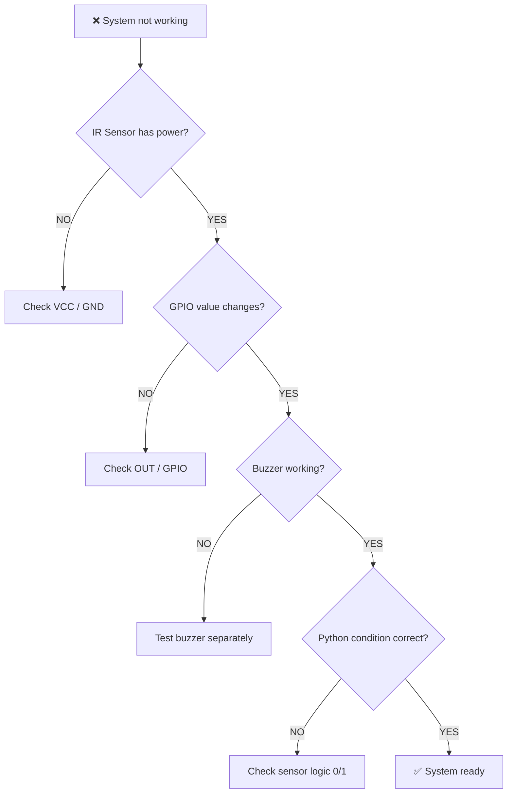

# 🚨 Opgave no : 1 – Simple Security Alarm
## IR-sensor • Raspberry Pi • Python • Buzzer • Event Detection


---

> ## 🎯 Mission
>
> Byg et lille **sikkerhedssystem**, hvor en IR-sensor registrerer en person eller et objekt ved en indgang.
>
> Når sensoren registrerer noget, skal Raspberry Pi aktivere en **buzzer-alarm i 3 sekunder** og derefter automatisk nulstille systemet.

---

# 🌟 Projektidé

Forestil dig en dør eller indgang:

```text
🚪 ENTRANCE

       🚶 Person
          │
          ▼
       📡 IR Sensor
          │
          ▼
    🧠 Raspberry Pi
          │
          ▼
       🚨 Buzzer
```

Systemet overvåger området kontinuerligt.

Hvis ingen person registreres:

```text
✅ AREA CLEAR
```

Hvis nogen passerer sensoren:

```text
⚠️ MOVEMENT DETECTED!

🚨 ALARM ACTIVATED!
```

Efter 3 sekunder:

```text
✅ Alarm reset
```

---

# 🎯 Læringsmål

Efter opgaven skal den studerende kunne:

- forstå, hvordan en **IR-sensor** fungerer
- læse et digitalt sensorinput med Raspberry Pi
- kontrollere en buzzer via GPIO
- bruge `if / else` i Python
- bruge en `while True`-løkke
- anvende `time.sleep()`
- arbejde med input og output
- implementere et simpelt eventsystem
- håndtere `KeyboardInterrupt`
- kombinere hardware og Python

---

# 🧰 Udstyr

| Komponent | Funktion |
|---|---|
| 🍓 Raspberry Pi | Kører Python-programmet |
| 📡 IR-sensor | Registrerer objekt/person |
| 🚨 Buzzer | Genererer alarmsignal |
| 🔌 Jumper wires | Elektriske forbindelser |
| 🧱 Breadboard | Valgfri |
| 🐍 Python | Programmering |

---

# 📡 Hvordan fungerer IR-sensoren?

IR betyder:

## Infrared

Sensoren sender infrarødt lys mod omgivelserne.

```text
📡 IR Sensor

     ))))))))))))
             ↓

            🚶
          Person
```

Når lyset reflekteres tilbage fra et objekt, kan sensoren registrere det.

```text
IR Sensor
   │
   │ send IR
   ▼
 🚶 Person
   │
   │ reflection
   ▼
IR Sensor
```

---

# 🧠 Fra sensor til alarm

Systemet arbejder efter:

```text
SENSE
  ↓
DECIDE
  ↓
ACT
```

Mere konkret:

```text
📡 IR Sensor
     ↓
Read GPIO
     ↓
🧠 Python Decision
     ↓
Object detected?
   /        \
 NO         YES
 │           │
 ▼           ▼
Wait      🚨 Alarm
             │
             ▼
         Wait 3 sec
             │
             ▼
           Reset
```

---

# 🔌 Eksempel på GPIO-forbindelser

Vi kan eksempelvis bruge:

| Komponent | Raspberry Pi |
|---|---|
| IR VCC | 3.3V/5V afhængigt af modulet |
| IR GND | GND |
| IR OUT | GPIO17 |
| Buzzer + | GPIO18 |
| Buzzer - | GND |

> ⚠️ **Vigtigt:** Kontrollér altid sensorens datablad og sørg for, at signalet til Raspberry Pi GPIO er **3.3V-kompatibelt**.

---

# 🎨 Forenklet kredsløbsdiagram

```text
            ┌──────────────────────┐
            │     Raspberry Pi     │
            │                      │
IR OUT ────►│ GPIO17               │
            │                      │
            │ GPIO18 ───────────┐  │
            └───────────────────┼──┘
                                │
                                ▼
                             🚨 Buzzer

IR Sensor
┌───────────┐
│ VCC       │──── Power
│ GND       │──── GND
│ OUT       │──── GPIO17
└───────────┘
```

---

# 🐍 Python Setup

Først importerer vi bibliotekerne:

```python
import RPi.GPIO as GPIO
import time
```

---

# ⚙️ GPIO Configuration

```python
GPIO.setwarnings(False)
GPIO.setmode(GPIO.BCM)

IR_SENSOR = 17
BUZZER = 18

GPIO.setup(IR_SENSOR, GPIO.IN)
GPIO.setup(BUZZER, GPIO.OUT)
```

Her er:

```text
IR_SENSOR
    ↓
INPUT

BUZZER
    ↓
OUTPUT
```

---

# 📡 Læs IR-sensoren

Sensorens status kan læses med:

```python
sensor_value = GPIO.input(IR_SENSOR)
```

En mulig digital sensor kan eksempelvis give:

```text
0 = Object detected
1 = No object
```

> Sensorlogikken kan være omvendt på jeres hardware. Test derfor sensoren først.

---

# 🧪 Delopgave 1 – Test sensoren

Start med kun at teste IR-sensoren.

```python
import RPi.GPIO as GPIO
import time

GPIO.setmode(GPIO.BCM)

IR_SENSOR = 17

GPIO.setup(IR_SENSOR, GPIO.IN)

try:

    while True:

        value = GPIO.input(IR_SENSOR)

        print("Sensor:", value)

        time.sleep(0.2)

except KeyboardInterrupt:

    GPIO.cleanup()
```

---

# 🖥️ Forventet output

Når ingen person registreres:

```text
Sensor: 1
Sensor: 1
Sensor: 1
```

Når et objekt passerer:

```text
Sensor: 1
Sensor: 0
Sensor: 0
Sensor: 1
```

---

# 🚨 Delopgave 2 – Test Buzzeren

Test derefter buzzeren alene.

```python
GPIO.output(BUZZER, GPIO.HIGH)

time.sleep(1)

GPIO.output(BUZZER, GPIO.LOW)
```

Forventet:

```text
🚨 BEEP!

1 second

🔇 OFF
```

---

# 🧠 Delopgave 3 – Alarm Logic

Nu kombinerer vi sensor og buzzer.

Reglen er:

```text
IF movement detected

    Activate alarm

    Wait 3 seconds

    Stop alarm

ELSE

    Continue monitoring
```

---

# 🌈 Flowchart



---

# 🐍 Komplet Python-eksempel

```python
import RPi.GPIO as GPIO
import time


# ============================================
# GPIO SETUP
# ============================================

GPIO.setwarnings(False)
GPIO.setmode(GPIO.BCM)

IR_SENSOR = 17
BUZZER = 18

GPIO.setup(IR_SENSOR, GPIO.IN)
GPIO.setup(BUZZER, GPIO.OUT)

GPIO.output(BUZZER, GPIO.LOW)


# ============================================
# MAIN PROGRAM
# ============================================

print("===================================")
print("   SIMPLE SECURITY ALARM SYSTEM")
print("===================================")
print("Monitoring entrance...")
print()


try:

    while True:

        sensor_value = GPIO.input(IR_SENSOR)

        # Adjust this condition if your
        # sensor uses opposite logic.

        if sensor_value == GPIO.LOW:

            print("⚠️ MOVEMENT DETECTED!")
            print("🚨 Alarm activated!")

            GPIO.output(BUZZER, GPIO.HIGH)

            time.sleep(3)

            GPIO.output(BUZZER, GPIO.LOW)

            print("✅ Alarm reset")
            print("Monitoring entrance...")
            print()

        time.sleep(0.1)


except KeyboardInterrupt:

    print("\nSecurity system stopped by user.")


finally:

    GPIO.output(BUZZER, GPIO.LOW)

    GPIO.cleanup()
```

---

# 🖥️ Eksempel på terminal-output

```text
===================================
   SIMPLE SECURITY ALARM SYSTEM
===================================

Monitoring entrance...

⚠️ MOVEMENT DETECTED!
🚨 Alarm activated!

✅ Alarm reset

Monitoring entrance...
```

---

# 🧪 Hovedopgave

## 🚨 Build a Simple Security Alarm

Byg et system, som automatisk overvåger en indgang.

Systemet skal:

- [ ] initialisere IR-sensoren
- [ ] initialisere buzzeren
- [ ] overvåge sensoren kontinuerligt
- [ ] registrere en person eller et objekt
- [ ] vise `MOVEMENT DETECTED`
- [ ] aktivere buzzeren
- [ ] holde alarmen aktiv i 3 sekunder
- [ ] deaktivere buzzeren
- [ ] nulstille systemet
- [ ] fortsætte overvågningen

---

# 🔄 Systemets komplette arbejdsgang

```text
                 🚪 ENTRANCE
                       │
                       ▼
                   🚶 Person
                       │
                       ▼
                  📡 IR Sensor
                       │
                       ▼
                 Raspberry Pi
                       │
                       ▼
                 Read GPIO Input
                       │
                       ▼
                Movement detected?
                   /        \
                 NO          YES
                 │            │
                 ▼            ▼
             Continue       🚨 Buzzer
            monitoring          │
                 ▲              ▼
                 │          Wait 3 sec
                 │              │
                 │              ▼
                 └──────── Alarm Reset
```

---

# 🎥 Live Test Session

## Test 1 – Ingen person

Lad området være frit.

Forventning:

```text
✅ Monitoring...
```

Buzzeren skal være:

```text
OFF
```

---

## Test 2 – Bevæg hånden foran sensoren

```text
👋
 │
 ▼
📡
```

Forventning:

```text
⚠️ MOVEMENT DETECTED
🚨 Alarm activated!
```

Buzzeren skal aktiveres.

---

## Test 3 – Alarm timeout

Vent:

```text
3 seconds
```

Forventning:

```text
Alarm reset
```

Buzzeren stopper.

---

## Test 4 – Ny person

Efter reset skal systemet igen være klar.

```text
🚶
 ↓
📡
 ↓
🚨
```

---

# 🎓 Undervisningsaktivitet – Human Security System

Fordel fire roller:

```text
🚶 Person

📡 IR Sensor

🧠 Raspberry Pi

🚨 Buzzer
```

En studerende går gennem "indgangen".

Sensor-studerende siger:

```text
MOVEMENT DETECTED
```

Raspberry Pi-studerende beslutter:

```text
BUZZER ON
```

Efter 3 sekunder:

```text
BUZZER OFF
```

Dette demonstrerer:

```text
INPUT
  ↓
PROCESS
  ↓
OUTPUT
```

---

# ⭐ Challenge 1 – Tilføj LED

Når alarmen starter, skal både buzzer og LED aktiveres.

```text
Movement
   ↓
📡 Sensor
   ↓
🧠 Python
   ↓
├── 🚨 Buzzer
│
└── 🔴 LED
```

---

# ⭐⭐ Challenge 2 – Alarm Counter

Tæl hvor mange gange alarmen er blevet aktiveret.

```python
alarm_count = 0
```

Når bevægelse registreres:

```python
alarm_count += 1
```

Eksempel:

```text
Alarm #1 detected
Alarm #2 detected
Alarm #3 detected
```

---

# ⭐⭐⭐ Challenge 3 – Gem tidspunkt

Gem tidspunktet for hver alarm.

Eksempel:

```text
Movement detected: 10:32:15
Movement detected: 10:35:42
Movement detected: 10:41:09
```

---

# ⭐⭐⭐⭐ Challenge 4 – CSV Event Log

Gem hændelserne i:

```text
security_log.csv
```

Eksempel:

```csv
event,time
1,10:32:15
2,10:35:42
3,10:41:09
```

Nu har systemet:

```text
Sensor
   +
Alarm
   +
Data Logging
```

---

# ⭐⭐⭐⭐⭐ Challenge 5 – Smart Security System

Udvid systemet med:

```text
📡 IR Sensor
     │
     ▼
🚶 Detection
     │
     ▼
📷 Camera
     │
     ▼
🧠 AI / Computer Vision
     │
     ▼
🚨 Alarm
     │
     ▼
📝 Event Log
```

Det bliver starten på et mere avanceret:

# 🤖 AI Security System

---

# 🛠️ Debugging

Hvis systemet ikke virker:



---

# 🏆 Bedømmelse – 10 point

| Kriterium | Point |
|---|---:|
| 📡 IR-sensor fungerer korrekt | 2 |
| 🐍 Sensor aflæses korrekt i Python | 2 |
| 🚨 Buzzer aktiveres ved registrering | 2 |
| ⏱️ Alarm stopper efter 3 sekunder | 1 |
| 🔄 Systemet nulstilles automatisk | 1 |
| 📝 Struktur og kommentarer | 1 |
| 🧪 Test og demonstration | 1 |
| **TOTAL** | **10** |

---

# 🧠 Refleksionsspørgsmål

1. Hvad betyder `GPIO.IN`?
2. Hvad betyder `GPIO.OUT`?
3. Hvordan registrerer IR-sensoren et objekt?
4. Hvorfor bruger vi `while True`?
5. Hvorfor bruger vi `time.sleep(3)`?
6. Hvad sker der, hvis sensoren konstant registrerer et objekt?
7. Hvordan kan vi undgå, at samme person udløser alarmen mange gange?
8. Hvordan kunne vi gemme alarmhistorikken?
9. Hvordan kunne et kamera forbedre systemet?
10. Hvordan kunne AI bruges i et mere avanceret sikkerhedssystem?

---

# 🌟 Hvad lærer vi?

```text
IR Sensor
    │
    ▼
GPIO Input
    │
    ▼
Python
    │
    ▼
Decision
    │
    ▼
GPIO Output
    │
    ▼
Buzzer
    │
    ▼
Security Alarm
```

---

# 🚀 Fra simpel alarm til intelligent system

```text
Simple IR Sensor
       ↓
Object Detection
       ↓
Buzzer Alarm
       ↓
Event Counter
       ↓
Data Logging
       ↓
Camera
       ↓
Computer Vision
       ↓
AI Person Detection
       ↓
🤖 Smart Security System
```

---

> ## 💡 Husk
>
> **Sensoren observerer. Python beslutter. Buzzeren reagerer.**

# 📡 Sense → 🧠 Decide → 🚨 Alert → 🔄 Reset
