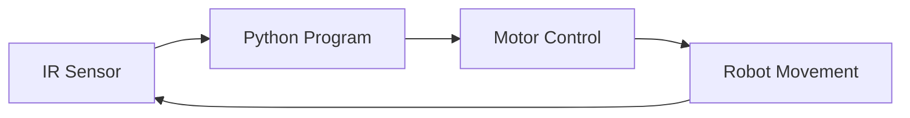
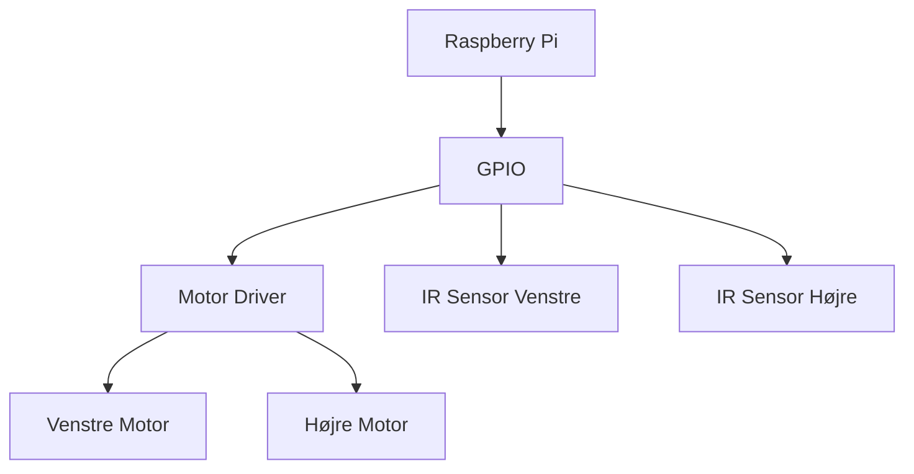
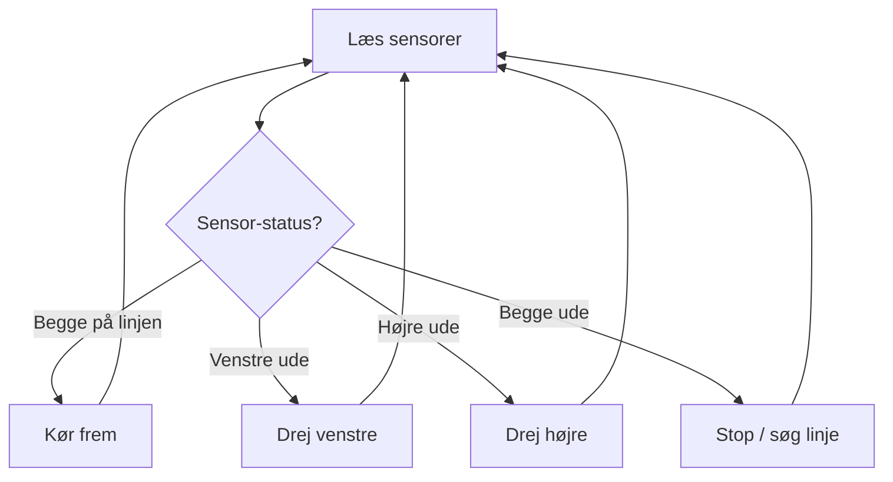
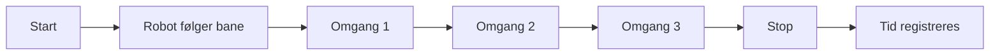

# 🏁 Konkurrenceopgave: Line Following Robot med Raspberry Pi & Python


---

# 🤖 Line Following Robot Race Challenge

## 📘 Tema

I denne opgave skal I designe, bygge og programmere en **line following robot**, som kan følge en sort bane ved hjælp af **IR-linjesensorer**, **Raspberry Pi** og **Python**.

Robotten skal kunne gennemføre:

```text id="8rqt0r"
3 omgange
```

på den kortest mulige tid **uden at forlade banen**.

---

# 🎯 Learning Objectives

Efter opgaven skal de studerende kunne:

* styre motorer med **Raspberry Pi GPIO/PWM**,
* anvende **linjesensorer (IR / reflectance sensors)** til at registrere sort tape,
* programmere i **Python** med løkker, betingelser og motorstyring,
* teste, fejlfinde og optimere robotadfærd,
* registrere og analysere data fra flere forsøg.

---

# 📋 Opgavebeskrivelse

> **Jeres team skal designe, bygge og programmere en robot med Raspberry Pi, som kan gennemføre 3 omgange på en sort tape-bane på kortest mulig tid. Robotten skal blive inden for banens grænser og må ikke køre af banen.**

---

# 🛠️ Materialer

## Hardware

* Raspberry Pi (fx Pi 3B+, Pi 4 eller Pi 5)
* Motor driver (fx **L298N**, **L293D** eller **TB6612FNG**)
* 2 DC-motorer med hjul og chassis
* IR line-follow sensorer (fx **TCRT5000** eller **QTR-8A**)
* Batteripakke / strømforsyning
* Sort elektrisk tape til bane
* Ledninger / jumper wires

## Software

* Python
* `RPi.GPIO` eller `gpiozero`
* VS Code / terminal på Raspberry Pi

---

# 🧠 Hvad er en Line Following Robot?

En **line following robot** er en robot, som bruger sensorer til at registrere en linje på gulvet og derefter justerer sine motorer, så den kan følge banen automatisk.

Typisk:

```text id="4h3xwv"
Hvid overflade = høj refleksion
Sort tape      = lav refleksion
```

Sensoren måler forskellen og sender signaler til Python-programmet.

---

# 👁️ Grundidé



Robotten arbejder altså i en slags **feedback loop**:

```text id="k9rckn"
Sense → Decide → Act → Repeat
```

---

# 🧩 Hvordan virker linjesensorer?

IR-linjesensorer sender infrarødt lys ned mod underlaget.

* Hvis underlaget er **hvidt**, reflekteres mere lys tilbage.
* Hvis underlaget er **sort**, absorberes mere lys.

Derfor kan sensoren skelne mellem:

```text id="8qo50c"
Sort tape
Hvid baggrund
```

---

## 🎨 Simpel visualisering

```text id="9uozdy"
       Sensor
         ↓
   ┌───────────┐
   │           │
   │  Robot    │
   │           │
   └───────────┘
      ○     ○
      │     │
      ▼     ▼

   [S1]   [S2]

──────────────────────────  Hvid overflade
██████████████████████████  Sort tape
```

---

# 🛣️ Banen

Et eksempel på en bane kan se sådan ud:

```text id="9il68z"
START
  │
  ▼
╔══════════════════════════════╗
║                              ║
║   ██████████████████████     ║
║                     █        ║
║      █████████      █        ║
║      █       █      █        ║
║      █       ████████        ║
║                              ║
╚══════════════════════════════╝
```

Robotten skal kunne følge den sorte bane hele vejen rundt.

---

# 🏁 Konkurrencekrav

Robotten skal:

* starte fra startlinjen,
* følge den sorte bane,
* gennemføre **3 omgange**,
* holde sig inden for banen,
* opnå den bedst mulige tid.

---

# 📑 Faseopdelt opgave

---

# 🔧 Fase 1 — Setup & Hardware Test

## Opgaver

1. Forbind Raspberry Pi med motor driver og motorer.
2. Tilslut IR-linjesensor(er) til GPIO-pins.
3. Kontroller at motorerne kan:

   * køre fremad,
   * køre baglæns,
   * stoppe.
4. Kontroller at sensorerne kan registrere:

   * sort tape,
   * hvid baggrund.

---

## Visual hardwarestruktur



---

# ⚙️ Fase 2 — Grundlæggende Motorstyring

Før robotten kan følge en bane, skal den kunne udføre grundlæggende bevægelser.

## Robotten skal kunne:

* køre fremad,
* stoppe,
* dreje til venstre,
* dreje til højre.

---

## Simpel bevægelseslogik

| Venstre motor | Højre motor | Bevægelse    |
| ------------- | ----------- | ------------ |
| Frem          | Frem        | Kør frem     |
| Stop          | Frem        | Drej venstre |
| Frem          | Stop        | Drej højre   |
| Stop          | Stop        | Stop         |

---

## Visualisering

```text id="2iwnou"
⬆ Fremad

Venstre motor  ↑
Højre motor    ↑


↩ Drej venstre

Venstre motor  ⏹
Højre motor    ↑


↪ Drej højre

Venstre motor  ↑
Højre motor    ⏹
```

---

# 🧠 Fase 3 — Line Following (Kernealgoritme)

Robotten skal bruge sensordata til at beslutte, hvordan den skal bevæge sig.

Antag fx to sensorer:

* `left_sensor`
* `right_sensor`

---

## Logik

### Situation 1 — Begge sensorer ser banen korrekt

Robotten fortsætter fremad.

### Situation 2 — Venstre sensor mister linjen

Robotten skal korrigere mod venstre.

### Situation 3 — Højre sensor mister linjen

Robotten skal korrigere mod højre.

### Situation 4 — Begge sensorer mister linjen

Robotten skal stoppe eller søge efter banen igen.

---

## Visual beslutningsmodel



---

# 🐍 Python-struktur

Nedenfor er en simpel struktur, som kan bruges som udgangspunkt.

```python id="fapoyo"
# Pseudokode / simpel struktur

while True:

    left = read_left_sensor()
    right = read_right_sensor()

    if left == 1 and right == 1:
        forward()

    elif left == 0 and right == 1:
        turn_left()

    elif left == 1 and right == 0:
        turn_right()

    else:
        stop()
```

> **Bemærk:** Sensorværdier kan være omvendte afhængigt af sensor og kalibrering. Derfor skal I selv teste, om sort/hvid giver `0` eller `1`.

---

# 🧪 Fase 4 — Test, Justering og Optimering

Når robotten kan følge banen, skal I forbedre dens ydeevne.

I skal arbejde med:

* hastighed,
* drejehastighed,
* sensorplacering,
* stabilitet,
* reaktionstid.

---

## Typiske problemer

| Problem                 | Mulig årsag                 | Forslag             |
| ----------------------- | --------------------------- | ------------------- |
| Robotten kører af banen | For høj hastighed           | Sænk hastigheden    |
| Robotten zig-zagger     | For kraftige drej           | Justér styring      |
| Sensor læser forkert    | Dårlig afstand til underlag | Justér sensorhøjde  |
| Robotten stopper ofte   | Fejl i logik                | Tjek `if/elif/else` |

---

# 📊 Data Logging

De studerende skal registrere data fra deres forsøg.

## I skal logge:

* omgangstider
* antal gange robotten forlader banen
* evt. sensordata
* forbedringer mellem forsøg

---

## Eksempel på datasamling

| Forsøg | Omgang 1 | Omgang 2 | Omgang 3 | Total tid | Forlod bane? |
| ------ | -------: | -------: | -------: | --------: | ------------ |
| 1      |   18.4 s |   19.1 s |   18.7 s |    56.2 s | Ja           |
| 2      |   17.8 s |   18.2 s |   18.0 s |    54.0 s | Nej          |
| 3      |   17.5 s |   17.9 s |   17.6 s |    53.0 s | Nej          |

---

## Valgfri CSV-logning

Studerende kan også gemme data i en `.csv`-fil.

```text id="f837hp"
trial,lap1,lap2,lap3,total,left_track
1,18.4,19.1,18.7,56.2,yes
2,17.8,18.2,18.0,54.0,no
3,17.5,17.9,17.6,53.0,no
```

---

# 🧪 Laboratorieopgave

## 🏁 Hovedopgave

Byg og programmér en line following robot, som kan gennemføre **3 omgange** på banen hurtigst muligt.

---

## Delopgaver

### Delopgave 1 — Sensortest

Lav et program, som udskriver sensorværdier i terminalen.

Eksempel:

```text id="xqa7ji"
Venstre sensor: 1
Højre sensor:   0
```

---

### Delopgave 2 — Motortest

Lav et program, som tester:

```text id="4dh2ms"
forward()
left()
right()
stop()
```

---

### Delopgave 3 — Simpel line following

Få robotten til at følge en lige bane.

---

### Delopgave 4 — Kurver

Udvid programmet, så robotten også kan følge sving.

---

### Delopgave 5 — Konkurrence

Kør 3 fulde omgange og registrér tiden.

---

# 🏆 Konkurrenceregler

## Regler

* Robotten skal starte bag startlinjen.
* Robotten må ikke løftes eller hjælpes under løbet.
* Hvis robotten forlader banen, gives straf eller forsøget stoppes.
* Vinderholdet er det hold, der gennemfører 3 omgange på kortest tid.

---

## Forslag til bedømmelse

| Kategori                   |  Point |
| -------------------------- | -----: |
| Hardwareopsætning          |      2 |
| Sensorfunktion             |      2 |
| Motorstyring               |      2 |
| Line-following logik       |      2 |
| Stabilitet og test         |      1 |
| Data logging og refleksion |      1 |
| **Total**                  | **10** |

---

# 🎥 Live test-session

I afslutningen af forløbet gennemføres en **live test-session**.

## Testforløb

1. Holdet stiller robotten ved start.
2. Robotten starter.
3. Robotten følger banen.
4. Tiden registreres.
5. Resultatet dokumenteres.

---

## Live session diagram



---

# 🎯 Evalueringsspørgsmål

Efter testen skal holdet reflektere over:

1. Hvordan virkede sensorerne?
2. Hvilke problemer opstod under testen?
3. Hvordan påvirkede hastigheden robotten?
4. Hvordan kunne programmet forbedres?
5. Hvilke ændringer gav bedst resultat?

---

# 💡 Udvidelser / Challenges

Hvis I bliver hurtigt færdige, kan I prøve:

* at bruge **PWM** til mere præcis hastighedsstyring,
* at bruge **3 eller flere sensorer**,
* at tilføje en **PID-lignende regulering**,
* at logge data automatisk til fil,
* at sammenligne resultater mellem flere baner.

---

# 🚀 Videre perspektiv

Denne opgave er et vigtigt skridt mod mere avanceret robotik.

Fra:

```text id="1u98tr"
Line Following
```

til:

```text id="5w7oev"
Obstacle Avoidance
Computer Vision
Autonomous Navigation
AI-based Robotics
```

---

# 📺 Inspirationsvideo

**Video:**
https://www.youtube.com/watch?v=H8wVLaQeSWQ

---

# 🧠 Kort opsummering

```text id="r7kzzm"
Sensorer registrerer linjen
        ↓
Python aflæser sensorerne
        ↓
Programmet træffer beslutning
        ↓
Motorerne justerer bevægelsen
        ↓
Robotten følger banen
```

---

# ✅ Aflevering

Hver gruppe afleverer:

* Python-kode
* kort beskrivelse af hardwareopsætning
* forklaring af line-following logik
* tabel med testdata
* refleksion over forbedringer

---

# 🌟 Afsluttende tanke

> **En line following robot virker simpel, men den er et stærkt eksempel på, hvordan sensorer, programmering og motorstyring arbejder sammen i et autonomt system.**

---

## 🤖 Autonomous Robot with Python and AI

**Sense → Decide → Act → Improve**
