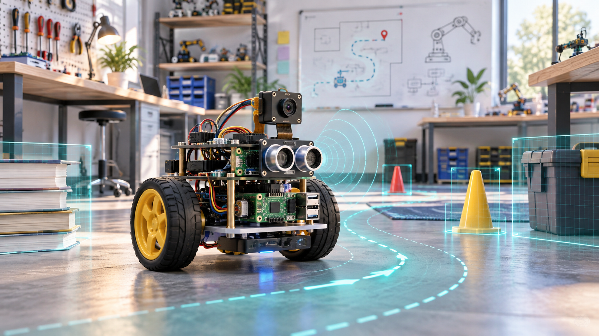
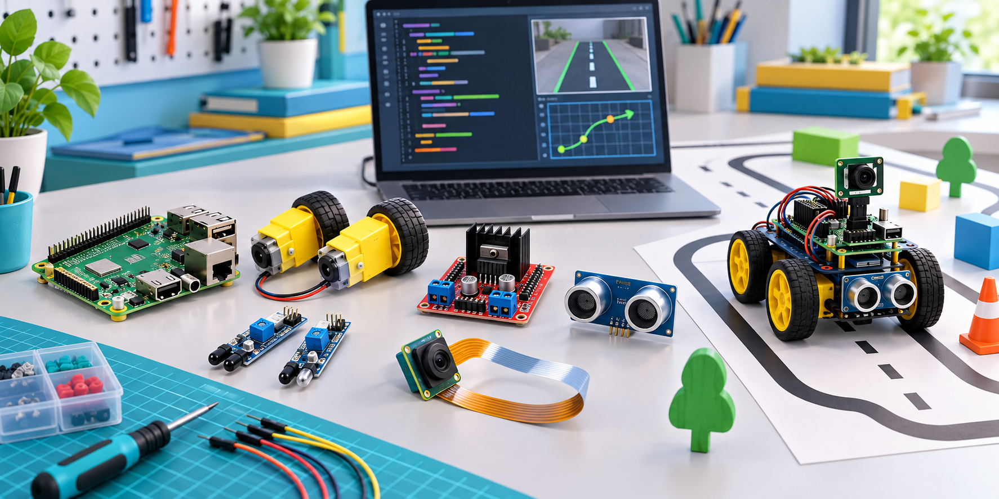

# Autonomous Robot with Python and AI

### A practice-based course in robotics, embedded programming, computer vision, and artificial intelligence

---

## Course Overview

This course teaches students how to design, program, test, and improve an autonomous robot using Python, artificial intelligence, and physical components such as sensors, motors, camera modules, and embedded controllers.

Students work hands-on with robotics architecture, sensor integration, machine learning, computer vision, and real-world autonomous behavior. The course is designed for students who want to move from theory to a working intelligent robot that can sense, decide, and act.

## Course Information

| Item | Description |
| --- | --- |
| **Programme** | Professional Bachelor in IT Technology, Zealand Academy |
| **Semester** | 3rd semester |
| **Duration** | 10 weeks including exam project |
| **ECTS** | Typically 5 ECTS |
| **Main Language** | Python |
| **Course Style** | Practical labs, coding exercises, robot testing, and final project |

## Learning Outcomes

By the end of the course, students will be able to:

- Understand basic robot architecture and sensor integration.
- Write Python code for robot control and data processing.
- Implement AI algorithms for navigation and decision-making.
- Use OpenCV so the robot can see, process, and interpret its surroundings.
- Train and apply simple machine learning models for classification or prediction.
- Design and test autonomous robot behavior in real-world environments.
- Debug, evaluate, and optimize robot performance.

  

## Hardware and Software

For the full equipment list, see the [hardware and software document](https://docs.google.com/document/d/1E7CKA_PeYkh11cRD16WwUXYstZygP8Gc7z8h1bNQiPA/edit?usp=sharing).

### Hardware

The setup can be adapted to student level and budget:

- Raspberry Pi 3 Model B+
- DC motors and L298N motor driver
- Ultrasonic sensor
- IR sensors
- Line-following sensors
- Pi Camera or USB camera
- Battery pack
- Robot chassis

### Software

- Python 3.x
- OpenCV
- TensorFlow/Keras or Scikit-learn
- GPIO libraries such as `RPi.GPIO` or `gpiozero`
- Jupyter Notebooks for prototyping
- Visual Studio Code
- VNC or SSH for remote access
- Remote SSH extension for Visual Studio Code

## Course Roadmap

| Week | Theme | Main Focus |
| --- | --- | --- |
| 1 | [Introduction to Robotics](Lecture1-Introduction-to-robotics/) | Robot architecture, embedded systems, Raspberry Pi setup, and basic motor movement |
| 2 | [Distance Sensing and Obstacle Avoidance](Lecture2-Distance-Sensing-and-Obstacle-Avoidance/) | Ultrasonic sensing, obstacle detection, and safe movement behavior |
| 3 | [Line Following with IR Sensors](Lecture3-Line-following-robot-with-IR-Sensors/) | IR sensor input, line detection, and control logic |
| 4 | [Line-Following Robot Race](Lecture4-Line-Following-Robot-Race-Competition/) | Speed, stability, competition testing, and performance tuning |
| 5 | [AI and Machine Learning](Lecture5-AI-ML-SL-UL/) | Supervised learning, unsupervised learning, datasets, and model thinking |
| 6 | [Deep Learning with TensorFlow/Keras](Lecture6-Deep-Learning-TensorFlow-Keras/) | Neural networks, training workflow, and practical AI integration |
| 7 | [Computer Vision with OpenCV](Lecture7-Computer-Vision-Opencv/) | Image processing, object detection, color tracking, and camera input |
| 8 | [Autonomous Navigation and AI Path Planning](Lecture8-Autonomous-Navigation-AI-Path-Planning/) | Sensor fusion, route planning, decision logic, and navigation strategies |
| 9 | [OpenClaw AI Autonomous Agent](Lecture9-OpenClaw-AI-Autonomous-Agent/) | Agent behavior, AI-driven actions, and integrated autonomy |
| 10 | [Exam Project Kickoff](Lecture10-KickOff-Eksamen-Projekt/) | Final project scope, prototype planning, testing, and documentation |

Additional project guidance is available in [Lecture 11 - Project Guidance Phase](Lecture11-ProjektVejledning-Phase/).

## Final Exam Project

As the final project, students develop an autonomous robot that can:

- Navigate in an unknown or semi-structured environment.
- Detect and avoid obstacles.
- Use computer vision for object recognition or environmental interpretation.
- Make decisions based on sensor data and AI models.
- Demonstrate a complete behavior loop: sense, process, decide, act, and evaluate.

The project is documented in a report and completed with a presentation and live demonstration.

## Assessment

The course is typically assessed through:

- Lab exercises and practical assignments
- Programming tasks
- Robot demonstrations
- Final autonomous robot project
- Project report and oral presentation

## Core Resources

| Resource | Link |
| --- | --- |
| Python Documentation | <https://docs.python.org> |
| OpenCV | <https://opencv.org> |
| Raspberry Pi Documentation | <https://www.raspberrypi.com/documentation/> |
| TensorFlow | <https://www.tensorflow.org> |
| Scikit-learn | <https://scikit-learn.org> |

---

### Build. Test. Improve. Repeat.

**Zealand Academy - Professional Bachelor in IT Technology**

  
**Developed with coordination with ZUhair (zukh@zealand.dk) og Tomasz.**

